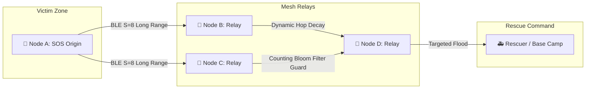

<div align="center">

# 🚨 OutGrid Mesh (TOG v1.1)

### Autonomous, Decentralized, Zero-Cost Spatial Mesh Communication Grid for Disaster Response & Remote Operations

[](https://github.com/thabot/outgrid-mesh/releases)
[](https://github.com/thabot/outgrid-mesh/actions)
[](LICENSE)
[](https://github.com/thabot/outgrid-mesh/releases/tag/v1.1.0-uat)
[-brightgreen.svg?style=for-the-badge&logo=bun)](tests)
[](#-thabot-outgrid-protocol-tog-v11)

<p align="center">
  <b>100% Offline • Zero Cellular Infrastructure • E2EE Encrypted • Long Range BLE Coded PHY • Global Vector Map</b>
</p>

[📥 Download Android APK](https://github.com/thabot/outgrid-mesh/releases/download/v1.1.0-uat/outgrid-rescue-uat.apk) •
[📖 GitHub Releases](https://github.com/thabot/outgrid-mesh/releases/tag/v1.1.0-uat) •
[🗺️ System Architecture](#-system-architecture) •
[⚡ Getting Started](#-getting-started) •
[🌐 10-Language Manuals](docs/manuals/) •
[📄 License & Author](#-license--author)

---

</div>

## 📌 Introduction

**OutGrid Mesh** is an autonomous, decentralized spatial mesh communications grid designed specifically for disaster situations where telecommunications infrastructure (4G/5G cellular towers, fiber optics, internet gateways) has suffered a 100% blackout or physical destruction (e.g., catastrophic flooding, devastating earthquakes, severe tropical cyclones, or wilderness search & rescue).

Powered by the bit-level **Thabot OutGrid Protocol (TOG v1.1)**, every consumer smartphone is transformed into an intelligent relay node. Packets traverse across devices using **Bluetooth Low Energy (BLE 5 Long Range Coded PHY S=8)**, **Wi-Fi Direct P2P**, and optional **LoRa / Briar companion bridges** up to **1,000 meters per hop** without relying on internet access, cellular networks, or central servers.

---

## 📥 Download & Install

Download the latest releases directly from GitHub:

| Distribution | Version | Download Link | Details |
| :--- | :---: | :---: | :--- |
| **Android APK (Direct Sideload)** | `v1.1.0-uat` | [📲 **outgrid-rescue-uat.apk**](https://github.com/thabot/outgrid-mesh/releases/download/v1.1.0-uat/outgrid-rescue-uat.apk) | Direct install on Android 8.0+ (Oreo to Android 15) |
| **GitHub Releases Page** | `v1.1.0-uat` | [📦 **Release Notes & Assets**](https://github.com/thabot/outgrid-mesh/releases/tag/v1.1.0-uat) | Changelog, APK artifacts, and SHA-256 Checksums |
| **Web PWA / Offline Bundle** | `v1.1.0` | [🌐 **SvelteKit PWA**](#-getting-started) | Runs in any modern browser with Service Worker offline cache |

> 💡 **Offline Wi-Fi Sideloading:** In isolated disaster zones without any internet connectivity, users can connect to the local Wi-Fi hotspot of an existing OutGrid Mesh device and open `http://192.168.49.1:8080` in their browser to download and install `OutGridMesh.apk` directly over-the-air.

---

## ✨ Key Capabilities & Features

```
                     ┌────────────────────────────────────────────────────────┐
                     │                   OUTGRID MESH ENGINE                  │
                     └───────────────────────────┬────────────────────────────┘
                                                 │
       ┌─────────────────────────┬────────────────┼─────────────────────────┬────────────────────────┐
       ▼                         ▼                ▼                         ▼                        ▼
🚨 One-Tap SOS Beacon     💬 1-on-1 E2EE Chat    🗺️ Offline Vector Map    📢 Ed25519 Crisis Feed   🔋 Adaptive Power Engine
(Compact 21 Bytes)        (X25519 + AES-GCM)     (<5MB World Basemap)      (Anti-Spoofing Verified) (100h+ Survival Profile)
```

1. **🚨 One-Tap SOS Emergency Beacon (`0x01`):**
   - High-density compression packing sub-meter GPS coordinates, Uber H3 Resolution 9 Hexagon index, battery percentage, and triage status into a compact **21-byte** broadcast.
   - Designed for high penetration through concrete and foliage over low-bandwidth physical radio links.

2. **💬 1-on-1 Direct Chat & Voice Memos (`0x02`):**
   - Text messaging, 15-second Opus/AAC voice notes, and compressed WebP situational photos.
   - End-to-End Encrypted via **X25519 ECDH + AES-256-GCM** with HKDF-SHA256 key derivation. Intermediate relay nodes cannot decrypt or tamper with message contents.

3. **📢 Verified Crisis Broadcast Feed (`0x04`):**
   - Official alerts, evacuation directives, safe zone locations, and water/medical supply distribution points.
   - Authenticated with **Ed25519 Digital Signatures** from incident command authorities, eliminating rumors and misinformation.

4. **🗺️ 100% Offline Worldwide Vector Basemap:**
   - Lightweight global basemap compressed under **5MB**, permanently cached in local SQLite / IndexedDB.
   - Integrated **Compass Radar Navigation** computing real-time relative bearings and distances to distressed survivors.

5. **🚚 DTN Bundle Store & Velocity Tracker (Data Mule):**
   - Store-and-Forward routing for mobile nodes traversing dead zones, carrying bundles between cut-off villages and relaying upon physical proximity encounters.
   - Velocity-aware mobility tracking and Hop Freeze governance to prevent premature packet drops.

6. **🔋 4-Tier Adaptive Battery Duty Cycle:**
   - Dynamic power scaling (`FULL_POWER` $\rightarrow$ `BALANCED` $\rightarrow$ `DEEP_HIBERNATION`) ensuring over 100+ hours of continuous background mesh operations.
   - Runs as an Android Foreground Service with Partial WakeLock.

7. **👥 100% Guest & Logged-in Accessibility Parity:**
   - Zero barrier to entry: Disaster victims have immediate access to all life-saving SOS and communication tools as a Guest without needing phone number verification or user registration.

8. **🌐 Universal 10-Language Support & Offline Field Guide:**
   - Built-in emergency survival manuals in 10 languages: Thai, English, Chinese, Spanish, Hindi, Arabic (with native RTL support), French, Russian, Portuguese, and Japanese.

---

## 📡 System Architecture

### 1. Thabot OutGrid Protocol (TOG v1.1 Wire Format)

```text
 0                   1                   2                   3
 0 1 2 3 4 5 6 7 8 9 0 1 2 3 4 5 6 7 8 9 0 1 2 3 4 5 6 7 8 9 0 1
+-+-+-+-+-+-+-+-+-+-+-+-+-+-+-+-+-+-+-+-+-+-+-+-+-+-+-+-+-+-+-+-+
|       Magic Word (0x544F)     | Ver | Type  | TTL/Hop | Pri |F|
+-+-+-+-+-+-+-+-+-+-+-+-+-+-+-+-+-+-+-+-+-+-+-+-+-+-+-+-+-+-+-+-+
|                       Source Node ID (8B)                     |
|                                                               |
+-+-+-+-+-+-+-+-+-+-+-+-+-+-+-+-+-+-+-+-+-+-+-+-+-+-+-+-+-+-+-+-+
|                    Destination Node ID (8B)                   |
|                                                               |
+-+-+-+-+-+-+-+-+-+-+-+-+-+-+-+-+-+-+-+-+-+-+-+-+-+-+-+-+-+-+-+-+
|    Sequence No (4B)           |   Timestamp Unix Seconds (4B) |
+-+-+-+-+-+-+-+-+-+-+-+-+-+-+-+-+-+-+-+-+-+-+-+-+-+-+-+-+-+-+-+-+
|                  Target Spatial H3 Index (8B)                 |
+-+-+-+-+-+-+-+-+-+-+-+-+-+-+-+-+-+-+-+-+-+-+-+-+-+-+-+-+-+-+-+-+
|     Payload Length (2B)       |   Payload Bytes (Variable)... |
+-+-+-+-+-+-+-+-+-+-+-+-+-+-+-+-+-+-+-+-+-+-+-+-+-+-+-+-+-+-+-+-+
```

### 2. Multi-Hop Epidemic Mesh Relay with Storm Guard



---

## 📂 Project Directory Structure

```text
OutGridMesh/
├── .github/workflows/          # CI/CD Pipelines (Android APK build & GitHub Releases)
├── android/                    # Native Android Runtime (Kotlin + Gradle 8.5)
│   ├── app/src/main/java/io/outgrid/mesh/
│   │   ├── MainActivity.kt               # Entrypoint UI & Hardware Permission Bridge
│   │   ├── OutGridMeshService.kt         # 24/7 Foreground Service & WakeLock
│   │   ├── BleRadioNativeDriver.kt       # BLE 5 Coded PHY S=8 Hardware Radio Driver
│   │   └── LocalHotspotSideloadService.kt# Offline APK HTTP Server & Hotspot
│   └── build.gradle                      # Android Build Configuration (AGP 8.2.2)
├── docs/
│   └── manuals/                # 10-Language Emergency Field Survival Manuals
│       ├── manual.en.md        # English
│       ├── manual.th.md        # Thai
│       ├── manual.zh.md        # Chinese
│       ├── manual.es.md        # Spanish
│       ├── manual.hi.md        # Hindi
│       ├── manual.ar.md        # Arabic (RTL)
│       ├── manual.fr.md        # French
│       ├── manual.ru.md        # Russian
│       ├── manual.pt.md        # Portuguese
│       └── manual.ja.md        # Japanese
├── src/
│   ├── core/                   # Platform-Independent Core Engine (Clean Architecture)
│   │   ├── crypto/             # E2EE (X25519 + AES-256-GCM), Ed25519 Signatures, HKDF
│   │   ├── dtn/                # Bundle Custody Store, Velocity Tracker, Hop Freeze
│   │   ├── i18n/               # 10-Language Universal Translation Engine
│   │   ├── network/            # Dynamic API Configuration & Zero-Cost Cloudflare Resolver
│   │   ├── protocol/           # TOG v1.1 Bitfield Serializer, Reed-Solomon 8+4 FEC, Sliding Window
│   │   ├── radio/              # BLE Coded PHY, Collision Shield, Wi-Fi P2P Driver
│   │   ├── routing/            # Epidemic Gossip Router, Dynamic Hop Decay, Bloom Filter
│   │   ├── spatial/            # 4-Tier H3 Geo-Hashing, Vector Basemap Parser, Radar Nav
│   │   └── storage/            # 50MB FIFO Quota Clamping Engine, SQLite/IndexedDB
│   └── ui/                     # Svelte 5 / SvelteKit High-Contrast Dark Mode UI & PWA
│       └── components/         # DonationDashboard, HelpManualScreen, CrisisFeed, RadarView
├── scripts/
│   ├── checkSyntax.js          # AST Syntax Verification Guard (Scans 160+ files)
│   └── generateTestVectorMap.js# 5MB Offline Basemap Generator
├── tests/                      # Automated Unit & Integration Tests (245 Tests / 76 Suites)
└── package.json                # SvelteKit, Bun, Noble Cryptography, H3 Spatial
```

---

## ⚡ Getting Started

### Prerequisites
- [Bun](https://bun.sh/) (recommended for sub-second automated test execution) or [Node.js](https://nodejs.org/) v20+
- [Android Studio](https://developer.android.com/studio) / Android SDK 34 (for compiling native Android APK)

### 1. Install Dependencies
```bash
bun install
```

### 2. Verify Syntax across Codebase
Run AST syntax checks across all TypeScript, JavaScript, and JSON files:
```bash
bun run check:syntax
# or node scripts/checkSyntax.js
```

### 3. Run Automated Test Suite
Execute all 245 unit and integration tests:
```bash
bun test
```

### 4. Run Web UI in Development Mode
```bash
bun dev
```
Navigate your browser to `http://localhost:5173`.

---

## 🛠️ Building Android APK

Build the APK locally or rely on automated GitHub Actions CI/CD workflows:

```bash
cd android
./gradlew assembleDebug
# Generated APK will be available at: android/app/build/outputs/apk/debug/app-debug.apk
```

---

## 🗺️ Project Milestones & Roadmap

- [x] **Phase 1:** Clean Architecture, Strict TypeScript, Bun Tooling & AST Syntax Guard.
- [x] **Phase 2:** TOG v1.1 Bitfield Packing, Reed-Solomon 8+4 FEC & Sliding Window NACK.
- [x] **Phase 3:** Zero-Knowledge Cryptography (X25519, AES-256-GCM, Ed25519) & Offline QR Pairing.
- [x] **Phase 4:** SQLite Schema Migration, 50MB Strict FIFO Clamping & Counting Bloom Filter.
- [x] **Phase 5:** 4-Tier Spatial H3 Grid (Res 9/7/5/4), Progressive K-Ring & Supernode Election.
- [x] **Phase 6:** DTN Delay-Tolerant Bundle Custody, Velocity Tracker & Hop Freeze.
- [x] **Phase 7:** Android Foreground Service (24/7 Relay), 4-Tier Battery Duty Cycle & Radio Bridges.
- [x] **Phase 8:** Offline Wi-Fi APK Sideload HTTP Server, Acoustic Morse Siren & Optical Torch.
- [x] **Phase 9:** Zero-Cost Cloudflare Pages/Workers, D1 Spatial DB & Transparent Donation Ledger.
- [x] **Phase 10:** Universal 10-Language i18n, Offline In-App Field Survival Guides & 15-Hop Simulation.

---

## 🤝 Community Sustainability & Transparent Donation

OutGrid Mesh is built as a **humanitarian public good**. Infrastructure costs are minimal due to true P2P mesh routing and free public STUN/Cloudflare tiers.
- **Open Ledger:** Real-time expense auditing showing actual cloud runtime vs community funds.
- **Hardware Fund:** Surplus donations are converted into solar-powered **ESP32 LoRa Repeater Nodes** gifted to flood/earthquake prone remote communities.
- **Support Channels:** Open Collective, GitHub Sponsors, and PromptPay via `DonationDashboard.svelte`.

---

## 📄 License & Author

- **Project Name:** OutGrid Mesh
- **Creator & Lead Architect:** **Thabot** (<thabo47@gmail.com>)
- **Wire Protocol:** **Thabot OutGrid Protocol (TOG v1.1)**
- **Official Inquiries & Commercial Licensing:** `thabo47@gmail.com`
- **License:** [GNU Affero General Public License v3.0 (AGPL-3.0)](LICENSE)
  - *Non-profit humanitarian public good. Commercial rights and dual-licensing reserved to Thabot.*
