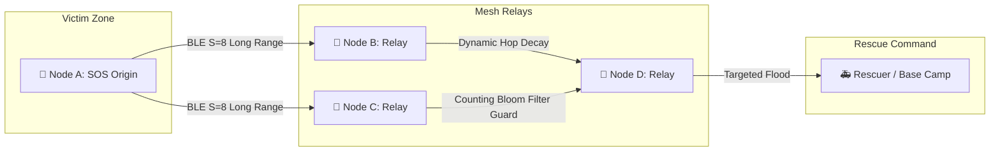

<div align="center">

# 🚨 OutGrid Mesh (TOG v1.1)

### Autonomous, Decentralized Spatial Mesh Communication Grid for Disaster Response & Remote Operations

[](https://github.com/thabot/outgrid-mesh/releases)
[](https://github.com/thabot/outgrid-mesh/actions)
[](LICENSE)
[](https://github.com/thabot/outgrid-mesh/releases)
[-brightgreen.svg?style=for-the-badge&logo=bun)](tests)
[](#-thabot-outgrid-protocol-tog-v11)

<p align="center">
  <b>100% Offline • Zero Cellular Infrastructure • E2EE Encrypted • Long Range BLE Coded PHY • Global Vector Map</b>
</p>

[📥 Download APK](#-download--install-for-users) •
[📖 GitHub Releases](https://github.com/thabot/outgrid-mesh/releases) •
[📱 How to Use](#-how-to-use-3-simple-steps) •
[🆘 Field Survival Guides](#-field-survival-guides--emergency-sop) •
[🗺️ System Architecture](#-system-architecture-overview) •
[💻 Developer Guide](docs/DEVELOPER_GUIDE.md) •
[📄 License & Author](#-license--author)

---

</div>

## 🆘 Field Survival Guides & Emergency SOP (คู่มือการเอาชีวิตรอดและรับมือภัยพิบัติ)

> **มาตรฐานขั้นตอนปฏิบัติการฉุกเฉิน 3 ระยะ (3-Phase SOP):** 🟢 ก่อนเกิดเหตุ (Pre-Disaster) • 🔴 ระหว่างเกิดเหตุ (Active Disaster / Blackout) • 🔵 กู้ภัยและเคลื่อนย้ายข้อมูล (Rescue & Data Mule)

เลือกภาษาเพื่ออ่านคู่มือการเอาชีวิตรอดภาคสนามฉบับสมบูรณ์:

| ภาษา (Language) | คู่มือการใช้งานภาคสนามและเอาชีวิตรอด (Field Survival Guide & SOP) |
| :--- | :--- |
| 🇹🇭 **ไทย (Thai)** | 👉 [**คู่มือการใช้งานภาคสนาม OutGrid Mesh และการเอาชีวิตรอดฉุกเฉิน (TH)**](docs/manuals/manual.th.md) |
| 🇬🇧 **English** | 👉 [**OutGrid Mesh Field Operations & Survival Guide (EN)**](docs/manuals/manual.en.md) |
| 🇨🇳 **中文 (Chinese)** | 👉 [**OutGrid Mesh 现场操作与应急求生指南 (ZH)**](docs/manuals/manual.zh.md) |
| 🇪🇸 **Español** | 👉 [**Guía de Operaciones de Campo y Supervivencia OutGrid Mesh (ES)**](docs/manuals/manual.es.md) |
| 🇯🇵 **日本語 (Japanese)** | 👉 [**OutGrid Mesh フィールド運用および緊急サバイバルガイド (JA)**](docs/manuals/manual.ja.md) |
| 🇫🇷 **Français** | 👉 [**Guide d'Opérations de Terrain et de Survie OutGrid Mesh (FR)**](docs/manuals/manual.fr.md) |
| 🇵🇹 **Português** | 👉 [**Guia de Operações de Campo e Sobrevivência OutGrid Mesh (PT)**](docs/manuals/manual.pt.md) |
| 🇷🇺 **Русский** | 👉 [**Руководство по Выживанию и Полевым Операциям OutGrid Mesh (RU)**](docs/manuals/manual.ru.md) |
| 🇸🇦 **العربية (Arabic)** | 👉 [**دليل العمليات الميدانية والبقاء في حالات الطوارئ OutGrid Mesh (AR)**](docs/manuals/manual.ar.md) |
| 🇮🇳 **हिन्दी (Hindi)** | 👉 [**OutGrid Mesh फील्ड संचालन एवं आपदा उत्तरजीविता गाइड (HI)**](docs/manuals/manual.hi.md) |

---

## 📌 Introduction

**OutGrid Mesh** is an autonomous, decentralized spatial mesh communications grid designed specifically for disaster situations where telecommunications infrastructure (4G/5G cellular towers, fiber optics, internet gateways) has suffered a 100% blackout or physical destruction (e.g., catastrophic flooding, devastating earthquakes, severe tropical cyclones, or wilderness search & rescue).

Powered by the bit-level **Thabot OutGrid Protocol (TOG v1.1)**, every consumer smartphone is transformed into an intelligent relay node. Packets traverse across devices using **Bluetooth Low Energy (BLE 5 Long Range Coded PHY S=8)**, **Wi-Fi Direct P2P**, and optional **LoRa / Briar companion bridges** up to **1,000 meters per hop** without relying on internet access, cellular networks, or central servers.

---

## 📥 Download & Install (For Users)

Users do not need to install developer tools or compile source code. Choose your channel below:

| Distribution Channel | Version | Direct Download Link | Description |
| :--- | :---: | :---: | :--- |
| **🚀 Production Release (Recommended)** | `Latest` | [📲 **outgrid-mesh.apk**](https://github.com/thabot/outgrid-mesh/releases/latest/download/outgrid-mesh.apk) | Official verified release from `main` branch (Always Latest) |
| **🧪 UAT Pre-Release (Bleeding-Edge)** | `Latest UAT` | [📲 **outgrid-mesh-uat.apk**](https://github.com/thabot/outgrid-mesh/releases/download/v1.1.0-uat/outgrid-mesh-uat.apk) | Latest build from `uat` branch (Always Latest UAT) |
| **📦 GitHub Releases Page** | All | [📂 **All Releases & Checksums**](https://github.com/thabot/outgrid-mesh/releases) | Review all release builds, changelog, and SHA-256 hashes |
| **🌐 Web PWA / Browser App** | `Latest` | [🖥️ **Web Dashboard PWA**](https://thabot.github.io/outgrid-mesh/) | Runs in any modern browser with offline service worker cache |

> 💡 **Offline Wi-Fi Sideloading:** In isolated disaster zones without any internet connectivity, users can connect to the local Wi-Fi hotspot of an existing OutGrid Mesh device and open `http://192.168.49.1:8080` in their browser to download and install `outgrid-mesh.apk` directly over-the-air.

---

## 📱 How to Use (3 Simple Steps)

You don't need an account, phone number verification, or internet access to use OutGrid Mesh:

1. **Step 1: Install & Open the APK**
   - Download the official [**`outgrid-mesh.apk`**](https://github.com/thabot/outgrid-mesh/releases/latest/download/outgrid-mesh.apk) (or [**`outgrid-mesh-uat.apk`**](https://github.com/thabot/outgrid-mesh/releases/download/v1.1.0-uat/outgrid-mesh-uat.apk) for UAT testers) and open the file on your Android device. Allow "Install from Unknown Sources" if prompted.
2. **Step 2: Turn ON Bluetooth & Location**
   - Grant Bluetooth and Nearby Devices permissions. The app will automatically discover neighbor nodes and establish an autonomous mesh grid in the background.
3. **Step 3: Start Chatting or Press SOS**
   - **Send Messages:** Tap any detected nearby survivor or rescuer to initiate end-to-end encrypted chats and voice memos.
   - **Emergency SOS:** In critical danger, press the big **Red SOS Button** to blast your GPS coordinates, battery level, and triage status to all nodes within hopping range.
   - **Share with Friends Offline:** Use the in-app **"Emergency APK Sideload"** feature to let friends without internet download the app directly from your phone.

---

## 🗺️ System Architecture Overview

OutGrid Mesh is built on a 5-layer modular client architecture coupled with a high-efficiency spatial edge coordinator, engineered for extreme disaster resilience, zero personal data retention, and ultra-low bandwidth consumption:

### 1. Client Layered Architecture
```text
┌────────────────────────────────────────────────────────────────────────┐
│                        OutGrid Mesh Client Architecture                │
│                                                                        │
│   ┌────────────────────────────────────────────────────────────────┐   │
│   │                     UI / Presentation Layer                    │   │
│   │  [One-Tap SOS]  [Offline Crisis Feed]  [Diagnostics Dashboard] │   │
│   │  [1-on-1 Chat]  [Community Fund UI]    [Offline Map & H3 Tile] │   │
│   │  [One-Tap QR Offline APK Share Modal]  [10-Language Manuals]   │   │
│   └────────────────────────────────┬───────────────────────────────┘   │
│                                    │                                   │
│   ┌────────────────────────────────▼───────────────────────────────┐   │
│   │                     Application State Engine                   │   │
│   │  - Mode State Machine (Cloud Online / Local Mesh / Disaster)   │   │
│   │  - Heartbeat & Auto-Fallback Monitor (5s Timeout)             │   │
│   │  - Battery-Aware Duty Cycle Policy Manager (4 Power Tiers)     │   │
│   └────────────────────────────────┬───────────────────────────────┘   │
│                                    │                                   │
│   ┌────────────────────────────────▼───────────────────────────────┐   │
│   │                  Security & Compression Layer                  │   │
│   │  - E2EE Engine (X25519 ECDH Key Exchange + AES-256-GCM)        │   │
│   │  - Ed25519 Digital Signature (SOS Authenticity & Anti-Spoof)   │   │
│   │  - Compact Binary Serializer (TOG v1.1 Bitfield ≤ 28B Header)  │   │
│   └────────────────────────────────┬───────────────────────────────┘   │
│                                    │                                   │
│   ┌────────────────────────────────▼───────────────────────────────┐   │
│   │                     Data & Forwarding Layer                    │   │
│   │  - Epidemic Gossip & Dynamic Hop Decay Router (1 - 15 Hops)    │   │
│   │  - Counting Bloom Filter & LRU Cache (Duplicate Storm Guard)   │   │
│   │  - SQLite DTN Store-and-Forward (Data Mule Custody Engine)     │   │
│   └────────────────────────────────┬───────────────────────────────┘   │
│                                    │                                   │
│   ┌────────────────────────────────▼───────────────────────────────┐   │
│   │                      Hybrid Transport Layer                    │   │
│   │     ┌───────────────────────┬────────────────────────────┐     │   │
│   │     │ BLE 5 Coded PHY (S=8) │   Wi-Fi Direct / SoftAP    │     │   │
│   │     │ (Text, SOS, GPS, Ping)│   (Voice, Images, APK S/L) │     │   │
│   │     ├───────────────────────┴────────────────────────────┤     │   │
│   │     │ Pluggable Radio Bridges (LoRa ESP32 & Briar BTP)   │     │   │
│   │     └────────────────────────────────────────────────────┘     │   │
│   └────────────────────────────────────────────────────────────────┘   │
└────────────────────────────────────────────────────────────────────────┘
```

---

### 2. Thabot OutGrid Protocol (TOG v1.1 Wire Specification)

The TOG v1.1 wire protocol packs complete routing and cryptographic metadata into an ultra-dense **28-byte fixed header**:

```text
 0                   1                   2                   3
 0 1 2 3 4 5 6 7 8 9 0 1 2 3 4 5 6 7 8 9 0 1 2 3 4 5 6 7 8 9 0 1
+-+-+-+-+-+-+-+-+-+-+-+-+-+-+-+-+-+-+-+-+-+-+-+-+-+-+-+-+-+-+-+-+
| Magic (0x544F)|Ver| Type  |TTL/Hop| Priority |Flags| Reserved | (4 Bytes)
+-+-+-+-+-+-+-+-+-+-+-+-+-+-+-+-+-+-+-+-+-+-+-+-+-+-+-+-+-+-+-+-+
|                     Message ID (uint64, 8 Bytes)              | (8 Bytes)
|                                                               |
+-+-+-+-+-+-+-+-+-+-+-+-+-+-+-+-+-+-+-+-+-+-+-+-+-+-+-+-+-+-+-+-+
|                  Sender Public Key Hash (8 Bytes)             | (8 Bytes)
+-+-+-+-+-+-+-+-+-+-+-+-+-+-+-+-+-+-+-+-+-+-+-+-+-+-+-+-+-+-+-+-+
|               Recipient / Topic Hash (8 Bytes)                | (8 Bytes)
+-+-+-+-+-+-+-+-+-+-+-+-+-+-+-+-+-+-+-+-+-+-+-+-+-+-+-+-+-+-+-+-+
|               Target H3 Index Res 9 (uint64, 8 Bytes)         | (8 Bytes)
+-+-+-+-+-+-+-+-+-+-+-+-+-+-+-+-+-+-+-+-+-+-+-+-+-+-+-+-+-+-+-+-+
| Payload Length (uint16, 2B)   |           Payload Data ...    | (Variable)
+-+-+-+-+-+-+-+-+-+-+-+-+-+-+-+-+-+-+-+-+-+-+-+-+-+-+-+-+-+-+-+-+
```

#### Protocol Bitfield Definitions:
1. **Magic Word (16 bits):** Constant `0x544F` (ASCII `'TO'` for *Thabot OutGrid*), instantly dropping malformed packets.
2. **Version (3 bits):** `0b001` (TOG v1.1).
3. **Packet Types (5 bits):**
   - `0x01` (`SOS_BEACON`): Life-saving distress alert with Ed25519 signature (21B payload).
   - `0x02` (`DIRECT_CHAT`): 1-on-1 end-to-end encrypted messaging (X25519 + AES-256-GCM).
   - `0x03` (`GROUP_CHAT`): Spatial community room messages decrypted via epoch group keys.
   - `0x04` (`CRISIS_FEED`): Authority civil protection broadcasts with Master Ed25519 signature.
   - `0x05` (`DELIVERY_ACK`): Reverse signed acknowledgment clearing hop caches.
   - `0x06` (`DELIVERY_NACK`): Selective retransmission request with bitmask chunks.
   - `0x07` (`PRESENCE_CHIRP`): Lightweight heartbeat for peer table and supernode election.
4. **Target Spatial H3 Index (64 bits):** Resolution 9 hexagon index (~100m) allowing intermediate nodes to compute hierarchical parent routes (`Res 7` sub-district, `Res 5` district, `Res 4` province) without GPS lookup tables.

---

### 3. Multi-Hop Epidemic Mesh Relay with Storm Guard



---

### 4. Cloudflare Spatial Edge Architecture

When an internet gateway or cellular connection is available, nodes coordinate through a lightweight, serverless edge layer:

```text
┌────────────────────────────────────────────────────────────────────────────────────────┐
│                        Cloudflare Edge Coordinator Architecture                        │
├────────────────────────────────────────────────────────────────────────────────────────┤
│                                                                                        │
│  [ Public STUN Servers ] (Google & Cloudflare STUN)                                    │
│         ▲                                                                              │
│         │ 1. NAT Discovery (Resolve client public IP/Port)                             │
│         │                                                                              │
│  [ Client Device A ] ──── 2. Exchange SDP Card (1 KB) ───► [ Cloudflare Worker ]       │
│                                                              │  (Spatial Coordinator)  │
│                                                              ▼                         │
│  [ Client Device B ] ◄─── 3. Match via H3 Hexagon Room ◄─────┴─ [ Cloudflare D1 ]       │
│         │                                                        - Ephemeral Presence  │
│         │                                                        - Anonymous Heatmap   │
│         ▼                                                                              │
│  [ Direct P2P WebRTC DataChannel ] ═════════════════════════════════════════════════   │
│  (Direct E2EE P2P communication - Server never touches chat payloads)                  │
│                                                                                        │
├────────────────────────────────────────────────────────────────────────────────────────┤
│  [ Inbound Emergency Alert Gateway ] (Civil Protection / Meteorological Agency)        │
│         │ POST /v1/alerts/broadcast (CAP Protocol + HMAC Token + Ed25519)              │
│         ▼                                                                              │
│  [ Cloudflare Worker ] ───► Ingest to D1 Spatial Cache ──► Edge nodes relay to Mesh    │
├────────────────────────────────────────────────────────────────────────────────────────┤
│  [ Cloudflare R2 Object Storage ] ─────────────────────► Global APK distribution       │
│  [ Cloudflare Pages ] ─────────────────────────────────► Public Heatmap & Web PWA      │
└────────────────────────────────────────────────────────────────────────────────────────┘
```

#### Core Edge Responsibilities:
- **Spatial H3 Signaling:** Matches WebRTC SDP handshakes inside shared H3 Resolution 7 hexagonal rooms (~5 km²). Once matched, traffic flows strictly peer-to-peer over WebRTC DataChannels.
- **Cloudflare D1 Ephemeral Table:** Stores ephemeral peer presence (`h3_index`, `peer_id_hash`, `battery_tier`, `is_supernode`) auto-expiring in 1 hour. Personal names, phone numbers, and raw GPS coordinates are strictly forbidden.
- **CAP Inbound Gateway:** Ingests official Common Alerting Protocol (CAP) alerts verified with Ed25519 authority signatures and distributes them directly to local mesh relays.

---

## 💻 Developer & Engineering Documentation

Looking to contribute, audit cryptography, or build from source? Read our full technical guide:

👉 [**Open Developer & Contributor Guide (`docs/DEVELOPER_GUIDE.md`)**](docs/DEVELOPER_GUIDE.md)

- Project Directory Structure & Clean Architecture boundaries
- Local setup, Bun test suite (`bun test`), and syntax verification
- Compiling Android Native APK locally (`./gradlew assembleDebug`)
- PR & Dual-Release contribution rules

---

## 🗺️ Project Milestones & Completed Roadmap

- [x] **Phase 1:** Clean Architecture, Strict TypeScript, Bun Tooling & AST Syntax Guard.
- [x] **Phase 2:** TOG v1.1 Bitfield Packing, Reed-Solomon 8+4 FEC & Sliding Window NACK.
- [x] **Phase 3:** Zero-Knowledge Cryptography (X25519, AES-256-GCM, Ed25519) & Offline QR Pairing.
- [x] **Phase 4:** SQLite Schema Migration, 50MB Strict FIFO Clamping & Counting Bloom Filter.
- [x] **Phase 5:** 4-Tier Spatial H3 Grid (Res 9/7/5/4), Progressive K-Ring & Supernode Election.
- [x] **Phase 6:** DTN Delay-Tolerant Bundle Custody, Velocity Tracker & Hop Freeze.
- [x] **Phase 7:** Android Foreground Service (24/7 Relay), 4-Tier Battery Duty Cycle & Radio Bridges.
- [x] **Phase 8:** Offline Wi-Fi APK Sideload HTTP Server, Acoustic Morse Siren & Optical Torch.
- [x] **Phase 9:** Cloudflare Pages/Workers, D1 Spatial DB & Transparent Donation Ledger.
- [x] **Phase 10:** Universal 10-Language i18n, Offline In-App Field Survival Guides & 15-Hop Simulation.

---

## 🤝 Community Sustainability & Transparent Donation

OutGrid Mesh is built as a **humanitarian public good**. Infrastructure costs are minimal due to true P2P mesh routing and public STUN/Cloudflare edge tiers.
- **Open Ledger:** Real-time expense auditing showing actual cloud runtime vs community funds.
- **Hardware Fund:** Surplus donations are converted into solar-powered **ESP32 LoRa Repeater Nodes** gifted to flood/earthquake prone remote communities.
- **Support Channels:** Open Collective, GitHub Sponsors, and PromptPay via `DonationDashboard.svelte`.

---

## 📄 License & Author

- **Project Name:** OutGrid Mesh
- **Creator & Lead Architect:** **Thabot** (<thabo47@gmail.com>)
- **Wire Protocol:** **Thabot OutGrid Protocol (TOG v1.1)**
- **Official Inquiries & Commercial Licensing:** `thabo47@gmail.com`
- **License:** [GNU Affero General Public License v3.0 (AGPL-3.0)](LICENSE)
  - *Non-profit humanitarian public good. Commercial rights and dual-licensing reserved to Thabot.*
