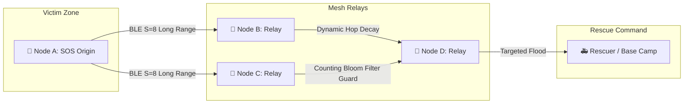

<div align="center">

# 🚨 OutGrid Mesh (TOG v1.1)

### Autonomous, Decentralized, Zero-Cost Spatial Mesh Communication Grid for Disaster Response & Remote Operations

[](https://github.com/thabot/outgrid-mesh/releases)
[](https://github.com/thabot/outgrid-mesh/actions)
[](LICENSE)
[](https://github.com/thabot/outgrid-mesh/releases/tag/v1.1.0-uat)
[-brightgreen.svg?style=for-the-badge&logo=bun)](tests)
[](#-thabot-outgrid-protocol-tog-v11)

<p align="center">
  <b>100% Offline • Zero Cellular Infrastructure • E2EE Encrypted • Long Range BLE Coded PHY • Global Vector Map</b>
</p>

[📥 ดาวน์โหลด Android APK](https://github.com/thabot/outgrid-mesh/releases/download/v1.1.0-uat/outgrid-rescue-uat.apk) •
[📖 GitHub Releases](https://github.com/thabot/outgrid-mesh/releases/tag/v1.1.0-uat) •
[🗺️ สถาปัตยกรรมระบบ](#-system-architecture) •
[⚡ เริ่มต้นใช้งาน](#-getting-started) •
[📄 รายละเอียดสิทธิบัตรและสัญญาอนุญาต](#-license--author)

---

</div>

## 📌 บทนำ (Introduction)

**OutGrid Mesh** คือโครงข่ายการสื่อสารทางภูมิสารสนเทศแบบไร้ศูนย์กลาง (Decentralized Spatial Mesh Network) ที่ถูกออกแบบมาเพื่อรับมือกับวิกฤตการณ์ที่โครงสร้างพื้นฐานด้านโทรคมนาคม (เสาสัญญาณ 4G/5G, ไฟเบอร์ออปติก, อินเทอร์เน็ต) ถูกทำลายหรือล่มสลาย 100% (เช่น น้ำท่วมใหญ่, แผ่นดินไหวรุนแรง, พายุไซโคลน หรือการปฏิบัติการในพื้นที่ทุรกันดารห่างไกล)

ระบบขับเคลื่อนด้วยโพรโทคอลระดับบิต **Thabot OutGrid Protocol (TOG v1.1)** เปลี่ยนสมาร์ตโฟนทั่วไปทุกเครื่องให้กลายเป็นโหนดรีเลย์ (Relay Node) รับ-ส่งต่อแพ็กเก็ตฉุกเฉินผ่าน **Bluetooth Low Energy (BLE 5 Long Range Coded PHY S=8)** และ **Wi-Fi Direct P2P** ได้ไกลสูงสุดทอดละ **1,000 เมตร** โดยไม่ต้องพึ่งพาเซิร์ฟเวอร์คลาวด์หรืออินเทอร์เน็ตแม้แต่วินาทีเดียว

---

## 📥 ดาวน์โหลดแอปพลิเคชัน (Download & Install)

สามารถดาวน์โหลดไฟล์ติดตั้งเวอร์ชันล่าสุดได้โดยตรงจาก GitHub Releases:

| รูปแบบการติดตั้ง | เวอร์ชัน | ลิงก์ดาวน์โหลด | หมายเหตุ |
| :--- | :---: | :---: | :--- |
| **Android APK (Direct Sideload)** | `v1.1.0-uat` | [📲 **outgrid-rescue-uat.apk**](https://github.com/thabot/outgrid-mesh/releases/download/v1.1.0-uat/outgrid-rescue-uat.apk) | ติดตั้งตรงบนมือถือ Android 8.0+ ได้ทันที |
| **GitHub Releases Page** | `v1.1.0-uat` | [📦 **Release Notes & Assets**](https://github.com/thabot/outgrid-mesh/releases/tag/v1.1.0-uat) | ตรวจสอบ Changelog และ SHA-256 Checksum |
| **Web PWA / Offline Bundle** | `v1.1.0` | [🌐 **SvelteKit PWA**](#-getting-started) | รันบนเว็บเบราว์เซอร์พร้อม Service Worker Cache |

> 💡 **Offline Wi-Fi Sideloading:** สำหรับเครื่องที่ไม่มีอินเทอร์เน็ต สามารถเชื่อมต่อ Wi-Fi Local Hotspot ของเครื่องที่มีแอป แล้วเปิดเบราว์เซอร์ไปที่ `http://192.168.49.1:8080` เพื่อดาวน์โหลด APK ผ่านเครือข่ายไร้สายเฉพาะกิจได้ทันที

---

## ✨ คุณสมบัติเด่น (Key Highlights & Capabilities)

```
                     ┌────────────────────────────────────────────────────────┐
                     │                   OUTGRID MESH ENGINE                  │
                     └───────────────────────────┬────────────────────────────┘
                                                 │
      ┌─────────────────────────┬────────────────┼─────────────────────────┬────────────────────────┐
      ▼                         ▼                ▼                         ▼                        ▼
🚨 One-Tap SOS Beacon     💬 1-on-1 E2EE Chat    🗺️ Offline Vector Map    📢 Ed25519 Crisis Feed   🔋 Adaptive Power Engine
(Compact 21 Bytes)        (X25519 + AES-GCM)     (<5MB World Basemap)      (Anti-Spoofing Verified) (100h+ Survival Profile)
```

1. **🚨 One-Tap SOS Emergency Beacon (`0x01`):**
   - บีบอัดข้อมูลวิกฤตครบถ้วน: พิกัด GPS แม่นยำระดับ < 1 เมตร, H3 Resolution 9 Hexagon, สถานะแบตเตอรี่, หมวดหมู่อาการบาดเจ็บ/ภัยพิบัติ บรรจุลงในแพ็กเก็ตขนาดเพียง **21 ไบต์**
   - ทะลวงกำแพงและสิ่งกีดขวางด้วยอัตราความสำเร็จสูงสุดบนคลื่นความถี่ต่ำ

2. **💬 1-on-1 Direct Chat & Media Sharing (`0x02`):**
   - แชตข้อความตัวอักษร, คลิปเสียงบีบอัดความยาว 15 วินาที (Voice Memo) และภาพถ่ายแผนที่/ความเสียหาย WebP
   - เข้ารหัสความปลอดภัยระดับทหาร **End-to-End Encryption (X25519 ECDH + AES-256-GCM)** โหนดรีเลย์ตัวกลางไม่สามารถดักอ่านได้

3. **📢 Offline Disaster Crisis Feed (`0x04`):**
   - ประกาศสถานการณ์ฉุกเฉิน คำสั่งอพยพ จุดแจกจ่ายน้ำและอาหาร
   - สลักลายเซ็นดิจิทัล **Ed25519 Digital Signature** จากศูนย์บัญชาการ ป้องกันข่าวลือ ข่าวปลอม (Anti-Spoofing) 100%

4. **🗺️ 100% Offline Worldwide Vector Basemap:**
   - แผนที่เวกเตอร์ทั้งโลกขนาดกะทัดรัดต่ำกว่า **5MB** พร้อม Cache เก็บใน IndexedDB/SQLite ในเครื่อง ไม่ต้องต่อเน็ต
   - ระบบเรดาร์เข็มทิศพิกัดนำทาง (Radar Navigation) ชี้ทิศทางและระยะทางมุ่งหน้าสู่ผู้ขอความช่วยเหลือแบบเรียลไทม์

5. **🔋 4-Tier Battery Policy & 24/7 Background Relay:**
   - สลับโหมดการใช้พลังงานอัตโนมัติตามระดับแบตเตอรี่ (Full Power $\rightarrow$ Balanced $\rightarrow$ Deep Hibernation)
   - รันเป็น Android Foreground Service พร้อม Partial WakeLock ทำหน้าที่รับ-ส่งต่อสัญญาณตลอดเวลาแม้หน้าจอดับ

6. **👥 100% Guest & Logged-in Accessibility Parity:**
   - ผู้ประสบภัยทุกคนเข้าถึงฟังก์ชันกู้ชีพได้ทันทีในฐานะ Guest โดยไม่ต้องลงทะเบียน ยืนยันเบอร์โทร หรือล็อกอิน

---

## 📡 สถาปัตยกรรมทางเทคนิค (System Architecture)

### 1. โครงสร้างแพ็กเก็ต Thabot OutGrid Protocol (TOG v1.1 Wire Format)
```
 0                   1                   2                   3
 0 1 2 3 4 5 6 7 8 9 0 1 2 3 4 5 6 7 8 9 0 1 2 3 4 5 6 7 8 9 0 1
+-+-+-+-+-+-+-+-+-+-+-+-+-+-+-+-+-+-+-+-+-+-+-+-+-+-+-+-+-+-+-+-+
|       Magic Word (0x544F)     | Ver | Type  | TTL/Hop | Pri |F|
+-+-+-+-+-+-+-+-+-+-+-+-+-+-+-+-+-+-+-+-+-+-+-+-+-+-+-+-+-+-+-+-+
|                       Source Node ID (8B)                     |
|                                                               |
+-+-+-+-+-+-+-+-+-+-+-+-+-+-+-+-+-+-+-+-+-+-+-+-+-+-+-+-+-+-+-+-+
|                    Destination Node ID (8B)                   |
|                                                               |
+-+-+-+-+-+-+-+-+-+-+-+-+-+-+-+-+-+-+-+-+-+-+-+-+-+-+-+-+-+-+-+-+
|    Sequence No (4B)           |   Timestamp Unix Seconds (4B) |
+-+-+-+-+-+-+-+-+-+-+-+-+-+-+-+-+-+-+-+-+-+-+-+-+-+-+-+-+-+-+-+-+
|                  Target Spatial H3 Index (8B)                 |
+-+-+-+-+-+-+-+-+-+-+-+-+-+-+-+-+-+-+-+-+-+-+-+-+-+-+-+-+-+-+-+-+
|     Payload Length (2B)       |   Payload Bytes (Variable)... |
+-+-+-+-+-+-+-+-+-+-+-+-+-+-+-+-+-+-+-+-+-+-+-+-+-+-+-+-+-+-+-+-+
```

### 2. Multi-Hop Epidemic Mesh Relay with Storm Guard


---

## 📂 โครงสร้างไดเรกทอรีโครงการ (Project Structure)

```text
OutGridMesh/
├── .github/workflows/          # CI/CD Pipelines (Android APK build & GitHub Releases)
├── android/                    # Native Android Runtime (Kotlin + Gradle 8.5)
│   ├── app/src/main/java/io/outgrid/mesh/
│   │   ├── MainActivity.kt               # Entrypoint UI & Hardware Permission Bridge
│   │   ├── OutGridMeshService.kt         # 24/7 Foreground Service & WakeLock
│   │   ├── BleRadioNativeDriver.kt       # BLE 5 Coded PHY S=8 Hardware Radio Driver
│   │   └── LocalHotspotSideloadService.kt# Offline APK HTTP Server & Hotspot
│   └── build.gradle                      # Android Build Configuration (AGP 8.2.2)
├── src/
│   ├── core/
│   │   ├── crypto/             # E2EE (X25519 + AES-256-GCM), Ed25519 Signatures
│   │   ├── protocol/           # TOG v1.1 Serializer, Counting Bloom Filter, Framing
│   │   ├── radio/              # BLE Coded PHY, Collision Shield, Wi-Fi P2P Driver
│   │   ├── routing/            # Epidemic Gossip Router, Dynamic Hop Decay
│   │   ├── spatial/            # H3 Delta Compressor (<1m), Vector Basemap, Radar
│   │   └── storage/            # 50MB FIFO Ceiling Engine, SQLite/IndexedDB Storage
│   └── ui/                     # Svelte 5 / SvelteKit UI Engine & PWA
├── scripts/
│   ├── checkSyntax.js          # AST Syntax Verification Guard
│   └── generateTestVectorMap.js# 5MB Offline Basemap Generator
├── tests/                      # Automated Unit & Integration Tests (135 Tests / 53 Suites)
└── package.json                # SvelteKit, Bun, Noble Cryptography, H3 Geo
```

---

## ⚡ เริ่มต้นใช้งาน (Getting Started)

### ความต้องการของระบบ (Prerequisites)
- [Bun](https://bun.sh/) (แนะนำสำหรับการทดสอบและการทำงานความเร็วสูง) หรือ [Node.js](https://nodejs.org/) v20+
- [Android Studio](https://developer.android.com/studio) / Android SDK 34 (สำหรับการคอมไพล์ Native Android)

### ติดตั้ง Dependencies
```bash
bun install
```

### ตรวจสอบความถูกต้องของ Syntax ทั้งโปรเจกต์
```bash
npm run check:syntax
# หรือ node scripts/checkSyntax.js
```

### รันชุดทดสอบอัตโนมัติ (Automated Test Suites)
ระบบมีชุดทดสอบครอบคลุมโพรโทคอลทุกมิติ รวมทั้งสิ้น 135 การทดสอบ:
```bash
bun test
```

### รัน Web UI ในโหมด Development
```bash
bun dev
```
เปิดเบราว์เซอร์ไปที่ `http://localhost:5173`

---

## 🛠️ การบิลด์ Android APK (Building Android APK)

คุณสามารถบิลด์ APK ได้ทั้งในเครื่องหรือปล่อยให้ GitHub Actions บิลด์อัตโนมัติ:

```bash
cd android
./gradlew assembleDebug
# ไฟล์ APK จะถูกสร้างที่ android/app/build/outputs/apk/debug/app-debug.apk
```

---

## 🗺️ แผนพัฒนาในอนาคต (Roadmap v2.0)
- [x] **v1.0 (MVP Completed):** One-Tap SOS, 1-on-1 E2EE Chat, Offline Crisis Feed, Global Vector Map, Native Android BLE Coded PHY Driver, GitHub Releases Pipeline.
- [ ] **v2.0 (Planned):** Zero-Knowledge Topic Group Chat (`0x03`), Epoch Key Rotation, Long-Range ESP32 LoRa Bridge (15–35 km backbone), Satellite Uplink Gateway (Iridium/Garmin).

---

## 📄 License & Author

- **ชื่อโครงการ:** OutGrid Mesh
- **ผู้คิดค้นและสถาปนิกหลัก (Creator & Lead Architect):** **Thabot** (<thabo47@gmail.com>)
- **โพรโทคอล:** **Thabot OutGrid Protocol (TOG v1.1)**
- **สัญญาอนุญาต (License):** [GNU Affero General Public License v3.0 (AGPL-3.0)](LICENSE)
  - *Commercial Rights & Patent Use Reserved to Thabot.*
