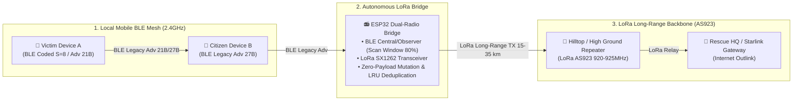

# Thabot OutGrid Protocol (TOG v1.1) LoRa Bridge Specification
### Global Emergency Cross-Radio Mesh Bridge Specification (BLE ↔ LoRa AS923)

> **Copyright & Intellectual Property:**
> - **Specification Name:** **Thabot OutGrid Protocol - LoRa Bridge Specification (TOG v1.1 LoRa Spec)**
> - **Creator & Lead Architect:** **Thabot** (<thabo47@gmail.com>)
> - **License:** **GNU Affero General Public License v3.0 (AGPL-3.0) + Commercial Rights Reserved to Thabot**
> - **Target Hardware:** ESP32 / ESP32-S3 + Semtech SX1262 / SX1276 LoRa Transceiver, Heltec Wireless Stick, TTGO T-Beam, Seeed Studio Wio-E5

---

## 1. Architecture Overview

The LoRa Bridge acts as an autonomous **Cross-Radio Relay Bridge** interfacing short-range smartphone Bluetooth Low Energy mesh networks (BLE 2.4GHz) with long-range community sub-gigahertz networks (LoRa AS923 920–925 MHz). This ensures that emergency distress beacons originated from off-grid consumer mobile devices can traverse mountainous terrain, high-rise buildings, and dense canopy over 15–35 km to reach rescue command headquarters.

---

## 2. Cross-Radio Invariants

1. **Zero-Payload Mutation:**
   - The LoRa Bridge operates strictly as a **Transparent L2/L3 Frame Forwarder**.
   - The bridge **must never alter** H3 coordinates, GPS Delta Offset, Battery status, message payload, or Ed25519 digital signatures generated by the originating device.
   - The **original CRC-16-CCITT** calculated by the originating device must be preserved identically (100%) so that rescue endpoints can verify payload authenticity without trusting intermediate relay nodes.

2. **Strict Loop & Duplicate Suppression:**
   - Every bridge node must maintain an active **Packet Deduplication Cache (LRU 64 entries)**.
   - **Cache Key:** `SHA-256(Packet Type + Short NodeID + First 4B of Payload)[0..7]`
   - If an incoming packet matches a Cache Key processed within the last **60 seconds**, it must be **dropped immediately (100% O(1) Drop)** to prevent packet storms and channel congestion.

3. **Hop Limit (TTL) Management:**
   - For packets containing a Hop Count field (Bits 5–7 of Byte 0), decrement Hop Count by 1 when relaying from BLE into LoRa.
   - If Hop Count reaches 0, relaying must cease immediately.

4. **Listen-Before-Talk & CAD (Channel Activity Detection):**
   - Prior to RF transmission, the SX1262 transceiver must perform **LoRa CAD (Channel Activity Detection)** for $\le 5\text{ms}$.
   - If channel activity is detected, apply a Random Exponential Backoff (50–200ms) before re-attempting transmission to avoid on-air RF collisions.

---

## 3. Physical RF Profile (LoRa Radio Parameters)

To ensure universal interoperability across diverse hardware nodes, conform to the following standard RF parameters:

| Parameter | Standard Value | Engineering Rationale |
| :--- | :--- | :--- |
| **Radio Frequency** | **`923.200 MHz`** (LoRa AS923 TH Band) | Compliant with NBTC regulatory requirements for Thailand and ASEAN region |
| **Bandwidth** | **`125 kHz`** | Optimal balance between receiver sensitivity and link range |
| **Spreading Factor (SF)** | **`SF9`** (Standard data) / **`SF11`** (Emergency SOS) | SF11 penetrates dense foliage and mountainous topography up to 20+ km |
| **Coding Rate (CR)** | **`4/5`** | Robust forward error correction against ambient RF noise |
| **Transmit Power (TX)** | **`+14 to +20 dBm`** (25–100 mW) | Energy-efficient for 18650 battery cells operating continuously on solar |
| **Preamble Length** | **`8 Symbols`** | Rapid carrier detection with minimized on-air transmission time |

---

## 4. Traffic Prioritization on LoRa Link

Due to limited LoRa channel bandwidth (effective throughput 1–5 kbps), strict traffic shaping must be enforced:

1. 🚨 **High Priority (100% Unrestricted): `0x01 SOS_BEACON` (21–25 Bytes) & Canned Emergency (10B)**
   - Preempts all ongoing scan cycles and transmits immediately (Zero-Queue Preemption).
2. 📡 **Normal Priority (Rate Limited): `0x07 PRESENCE_CHIRP` (15–27 Bytes)**
   - Only relayed by **Stationary or Supernodes**, capped at a maximum rate of **1 transmission per 60 seconds per H3 cell**.
3. 🔒 **Low Priority (Compressed Text Only): `0x02 DIRECT_CHAT`**
   - Restricted to short text messages with payload size $\le 60$ bytes.
4. 🚫 **Forbidden (Strictly Prohibited on LoRa): `MEDIA_CHUNK` (WebP Image / Opus Audio)**
   - Media chunks must never be broadcast over LoRa channels to prevent backbone saturation. They must be transmitted exclusively via **Wi-Fi Direct P2P or Mobile Rescue Data Mules**.

---

*This document constitutes the formal LoRa Bridge specification for Thabot OutGrid Protocol v1.1. Commercial rights reserved.*
