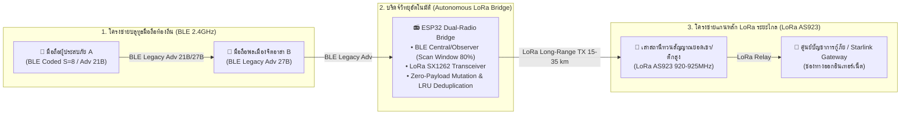

# ข้อกำหนดสะพานวิทยุสื่อสารระยะไกล LoRa (TOG v1.1 LoRa Bridge Specification)
### มาตรฐานการเชื่อมโยงและทวนสัญญาณข้ามคลื่นความถี่ BLE ↔ LoRa สำหรับโครงข่ายกู้ภัยฉุกเฉิน

> **ลิขสิทธิ์และทรัพย์สินทางปัญญา:**
> - **ชื่อข้อกำหนด:** **Thabot OutGrid Protocol - LoRa Bridge Specification (TOG v1.1 LoRa Spec)**
> - **ผู้คิดค้นและหัวหน้าสถาปนิก:** **Thabot** (<thabo47@gmail.com>)
> - **สัญญาอนุญาต:** **GNU Affero General Public License v3.0 (AGPL-3.0) + สงวนสิทธิ์ทางการค้าสำหรับ Thabot**
> - **ฮาร์ดแวร์เป้าหมาย:** ESP32 / ESP32-S3 + Semtech SX1262 / SX1276 LoRa Transceiver, Heltec Wireless Stick, TTGO T-Beam, Seeed Studio Wio-E5

---

## 1. ภาพรวมสถาปัตยกรรมสะพานวิทยุ (Architecture Overview)

สะพานวิทยุ LoRa Bridge ทำหน้าที่เป็น **ตัวกลางเชื่อมต่อและทวนสัญญาณข้ามย่านความถี่ (Cross-Radio Relay)** ระหว่างโครงข่ายบลูทูธระยะสั้นของสมาร์ตโฟน (BLE 2.4GHz) กับโครงข่ายวิทยุคลื่นชุมชนระยะไกล (LoRa AS923 920–925 MHz) เพื่อให้สัญญาณแจ้งเหตุฉุกเฉินจากโทรศัพท์มือถือที่ไม่มีสัญญาณอินเทอร์เน็ต สามารถเดินทางข้ามยอดเขา อาคารสูง หรือป่าทึบไปยังศูนย์บัญชาการกู้ภัยได้ไกลกว่า 15–35 กิโลเมตร

---

## 2. กฎเหล็กของสะพานข้ามสัญญาณ (Cross-Radio Invariants)

1. **ห้ามดัดแปลงข้อมูลเด็ดขาด (Zero-Payload Mutation):**
   - อุปกรณ์ LoRa Bridge ทำหน้าที่เป็น **Transparent L2/L3 Frame Forwarder**
   - **ห้ามแก้ไข** พิกัด H3, ค่าชดเชย GPS Delta Offset, สถานะแบตเตอรี่, ข้อความ หรือลายเซ็น Ed25519 ของอุปกรณ์ต้นทางโดยเด็ดขาด
   - ค่า **CRC-16-CCITT ดั้งเดิม** ที่คำนวณมาจากสมาร์ตโฟนต้นทางจะต้องได้รับการรักษาไว้ครบถ้วน 100% เพื่อให้ศูนย์กู้ภัยปลายทางสามารถตรวจสอบความถูกต้องแท้จริงของข้อมูลได้โดยตรงโดยไม่ต้องไว้ใจโหนดทางผ่าน

2. **ระบบป้องกันข้อมูลวนซ้ำ (Strict Loop & Duplicate Suppression):**
   - ทุกโหนดบริดจ์ต้องมีแคชตรวจสอบข้อมูลซ้ำ **Packet Deduplication Cache (LRU 64 รายการ)**
   - **Cache Key:** `SHA-256(Packet Type + Short NodeID + First 4B of Payload)[0..7]`
   - หากแพ็กเก็ตที่รับเข้ามามี Cache Key ตรงกับข้อมูลที่เพิ่งประมวลผลไปภายใน **60 วินาที** ต้อง **ตัดทิ้งทันที 100% (O(1) Drop)** เพื่อป้องกันพายุสัญญาณ (Packet Storms) และลดความแออัดของช่องสัญญาณ LoRa

3. **การจัดการขีดจำกัดการกระโดด (Hop Limit / TTL Management):**
   - สำหรับแพ็กเก็ตที่มีฟิลด์ Hop Count (Bits 5–7 ของ Byte 0) เมื่อรับจาก BLE ส่งต่อเข้า LoRa ให้ลด Hop Count ลง 1
   - หาก Hop Count มีค่าเท่ากับ 0 ต้องยุติการส่งต่อทันที

4. **การตรวจสอบช่องสัญญาณก่อนส่ง (Listen-Before-Talk & LoRa CAD):**
   - ก่อนเปิดสัญญาณส่ง (RF TX) ชิป SX1262 ต้องเข้าสู่โหมด **Channel Activity Detection (LoRa CAD)** เป็นเวลา $\le 5\text{ms}$
   - หากตรวจพบคอมพิวเตอร์วิทยุอื่นกำลังส่งสัญญาณในความถี่เดียวกัน ให้สุ่มหน่วงเวลาถอยกลับ (Random Exponential Backoff 50–200ms) ก่อนลองใหม่ เพื่อป้องกันการชนกันของสัญญาณในอากาศ

---

## 3. ค่ากำหนดทางกายภาพของคลื่นวิทยุ LoRa (Physical RF Profile)

เพื่อให้ฮาร์ดแวร์ทุกรุ่นสามารถรับส่งข้อมูลร่วมกันได้อย่างสมบูรณ์ ต้องกำหนดค่า RF ตามตารางมาตรฐานดังนี้:

| พารามิเตอร์ (Parameter) | ค่ามาตรฐาน (Standard Value) | เหตุผลทางวิศวกรรม (Engineering Rationale) |
| :--- | :--- | :--- |
| **ความถี่วิทยุ (Frequency)** | **`923.200 MHz`** (LoRa AS923 TH Band) | สอดคล้องกับระเบียบ กสทช. ของประเทศไทยและมาตรฐานภูมิภาคอาเซียน |
| **ความกว้างแถบความถี่ (Bandwidth)** | **`125 kHz`** | ความสมดุลที่ดีที่สุดระหว่างความไวในการรับสัญญาณ (Sensitivity) และระยะทาง |
| **Spreading Factor (SF)** | **`SF9`** (ข้อมูลทั่วไป) / **`SF11`** (ฉุกเฉิน SOS) | SF11 ทะลวงป่าเขาและสิ่งกีดขวางได้ไกลกว่า 20 กิโลเมตร |
| **อัตราการแก้รหัสผิดพลาด (Coding Rate)** | **`4/5`** | ป้องกันสัญญาณรบกวนในสภาพแวดล้อมวิกฤต |
| **กำลังส่งวิทยุ (Transmit Power)** | **`+14 ถึง +20 dBm`** (25–100 mW) | ประหยัดพลังงานสำหรับแบตเตอรี่ 18650 ทำงานต่อเนื่องด้วยโซลาร์เซลล์ |
| **ความยาวสัญญาณนำหน้า (Preamble)** | **`8 Symbols`** | ตรวจจับสัญญาณได้รวดเร็วและใช้เวลาส่งบนอากาศ (Air Time) น้อยที่สุด |

---

## 4. การจัดลำดับความสำคัญของช่องสัญญาณ LoRa (Traffic Prioritization)

เนื่องจากช่องสัญญาณ LoRa มีแบนด์วิธจำกัด (Effective Throughput 1–5 kbps) จึงต้องบังคับใช้มาตรการควบคุมปริมาณการจราจรอย่างเข้มงวด:

1. 🚨 **ความสำคัญสูงสุด (ส่งทันที 100%): `0x01 SOS_BEACON` (21–25 Bytes) และ Canned Emergency (10B)**
   - แทรกคิวส่งทันทีโดยไม่มีการรอ (Zero-Queue Preemption)
2. 📡 **ความสำคัญปกติ (จำกัดอัตราส่ง): `0x07 PRESENCE_CHIRP` (15–27 Bytes)**
   - ส่งต่อเฉพาะโหนดสถานีถาวร (Stationary Nodes) จำกัดไม่เกิน **1 ครั้งต่อ 60 วินาทีต่อเซลล์ H3**
3. 🔒 **ความสำคัญต่ำ (ข้อความสั้นบีบอัด): `0x02 DIRECT_CHAT`**
   - จำกัดเฉพาะข้อความสั้นที่มี Payload $\le 60$ ไบต์
4. 🚫 **ห้ามส่งเด็ดขาดบน LoRa (Strictly Prohibited): `MEDIA_CHUNK` (ภาพ WebP / เสียง Opus)**
   - ห้ามส่งไฟล์มัลติมีเดียผ่านคลื่น LoRa โดยเด็ดขาดเพื่อป้องกันช่องสัญญาณติดขัด ต้องส่งผ่าน **Wi-Fi Direct P2P หรือ Data Mule** เท่านั้น

---

*เอกสารฉบับนี้เป็นข้อกำหนดมาตรฐานสะพานวิทยุ LoRa ของ Thabot OutGrid Protocol v1.1 สงวนลิขสิทธิ์ทางการค้าโดย Thabot*
