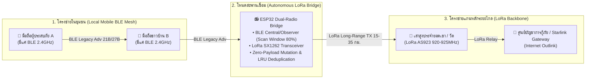

# Thabot OutGrid Protocol (TOG v1.1) Wire Specification
### ข้อกำหนดโครงสร้างโปรโตคอลวิทยุกู้ภัยฉุกเฉินระดับโลก (Cross-Radio Mesh Wire Spec)

> **ข้อมูลลิขสิทธิ์และสิทธิ์ทางปัญญา (Copyright & Intellectual Property):**
> - **ชื่อโพรโทคอล:** **Thabot OutGrid Protocol (TOG v1.1 Wire Specification)**
> - **ผู้คิดค้นและสถาปนิกหลัก (Creator & Lead Architect):** **Thabot** (<thabo47@gmail.com>)
> - **สัญญาอนุญาต (License):** **GNU Affero General Public License v3.0 (AGPL-3.0) + Commercial Rights Reserved to Thabot**
> - **อุปกรณ์ที่รองรับ (Transports):** Bluetooth 5.0 LE Legacy (31B), BLE Coded PHY (S=8), Wi-Fi Direct P2P, Wi-Fi HaLow (802.11ah Sub-1GHz), LoRa ESP32 Companion Bridge

---

## 1. ภาพรวมรูปแบบการส่งข้อมูลหลัก 4 ประเภท (The 4 Core Packet Types)

| รหัส Packet Type | ชื่อแพ็กเก็ต (Name) | ขนาดในอากาศ (Air Size) | ช่องทางส่ง (Transport) | คุณสมบัติและความปลอดภัย |
| :---: | :--- | :---: | :--- | :--- |
| `0x01` | **`SOS_BEACON`** | **21 – 25 Bytes** | BLE Coded S=8 / LoRa | พิกัดละเอียด < 1 เมตร (H3 Res 9 + Delta GPS 4B), ลายเซ็น Ed25519, ปลุกจอ 0ms |
| `0x02` | **`DIRECT_CHAT`** | $\le 280$ ตัวอักษร | BLE Extended Adv (255B) | E2EE สองชั้น (X25519 ECDH + AES-256-GCM Overhead 28B), Safety Numbers 8 หลัก |
| `0x07` | **`PRESENCE_CHIRP`** | **27 Bytes** | BLE Legacy Adv (31B) / LoRa | ส่งเพื่อนบ้านได้ 5 โหนด (H3 6 ทิศ 3b + Fused Bat/RSSI 5b), Radio Type 1B, CRC-16 |
| `0x02` (Frag) | **`MEDIA_CHUNK`** | Chunks ละ 180B | Wi-Fi Direct / HaLow / BLE | รูป WebP 5–12KB / เสียง Opus 2–3KB, Reed-Solomon FEC (8+4 Shards) ซ่อมไฟล์ได้ 33% |

---

## 2. โครงสร้างแพ็กเก็ตสถานะและเพื่อนบ้าน 5 โหนด (`0x07: PRESENCE_CHIRP` - 27 Bytes)

> **เป้าหมาย:** รายงานสถานะเครื่องและรายชื่อโหนดรอบตัวโดยไม่เกินเพดาน 31 Bytes ของ BLE Legacy พร้อมมี Check Digit ระดับอุตสาหกรรม และระบุความสามารถวิทยุข้ามระบบ

### 2.1 แผนภาพระดับบิต (Bitfield Layout)

```text
 0                   1                   2                   3
 0 1 2 3 4 5 6 7 8 9 0 1 2 3 4 5 6 7 8 9 0 1 2 3 4 5 6 7 8 9 0 1
+-+-+-+-+-+-+-+-+-+-+-+-+-+-+-+-+-+-+-+-+-+-+-+-+-+-+-+-+-+-+-+-+
|Type(5b)|Hop(3)|             Our Short NodeID (24 bits)        | (Bytes 0-3)
+-+-+-+-+-+-+-+-+-+-+-+-+-+-+-+-+-+-+-+-+-+-+-+-+-+-+-+-+-+-+-+-+
|Our Bat/Stat(1B|             Our Target H3 Res 9 (32 bits)     | (Bytes 4-7)
+-+-+-+-+-+-+-+-+-+-+-+-+-+-+-+-+-+-+-+-+-+-+-+-+-+-+-+-+-+-+-+-+
| (Cont. H3 1B) | Radio Type(1B)| Neighbor 1 Short NodeID (16b) | (Bytes 8-11)
+-+-+-+-+-+-+-+-+-+-+-+-+-+-+-+-+-+-+-+-+-+-+-+-+-+-+-+-+-+-+-+-+
|N1 Fused(H3/B/R| Neighbor 2 Short NodeID (16b) |N2 Fused(H3/B/R| (Bytes 12-15)
+-+-+-+-+-+-+-+-+-+-+-+-+-+-+-+-+-+-+-+-+-+-+-+-+-+-+-+-+-+-+-+-+
| Neighbor 3 Short NodeID (16b) |N3 Fused(H3/B/R| Neighbor 4 ...| (Bytes 16-19)
+-+-+-+-+-+-+-+-+-+-+-+-+-+-+-+-+-+-+-+-+-+-+-+-+-+-+-+-+-+-+-+-+
|... Short NodeID (16b)         |N4 Fused(H3/B/R| Neighbor 5 ...| (Bytes 20-23)
+-+-+-+-+-+-+-+-+-+-+-+-+-+-+-+-+-+-+-+-+-+-+-+-+-+-+-+-+-+-+-+-+
|... Short NodeID (16b)         |N5 Fused(H3/B/R|  CRC-16-CCITT | (Bytes 24-26)
+-+-+-+-+-+-+-+-+-+-+-+-+-+-+-+-+-+-+-+-+-+-+-+-+-+-+-+-+-+-+-+-+
| (Cont. CRC 1B)|  [ 4 Bytes Unallocated Radio Guard Headroom ]  | (End of 31B)
+-+-+-+-+-+-+-+-+-----------------------------------------------+
```

### 2.2 รายละเอียดระดับไบต์ (Byte Breakdown):

#### 1. ข้อมูลเครื่องเรา (Our Node Header - 9 Bytes)
- **Byte 0: Type & Hop (8 bits)**
  - `Bit 0–4 (5 bits)`: Packet Type = `0x07` (`PRESENCE_CHIRP`)
  - `Bit 5–7 (3 bits)`: Hop Count (0–7 ทอด)
- **Byte 1–3: Our Short NodeID (24 bits / 3 Bytes)**
  - รหัสประจำตัวเครื่อง 16,777,216 รหัส (สร้างจาก Truncated SHA-256 ของ Ed25519 Public Key)
- **Byte 4: Our Battery & Charging (8 bits / 1 Byte)**
  - `Bit 0–2 (3 bits)`: แบตเตอรี่ 5 ขีด (ระดับ 1–5 ขีด / ระดับละ 20%)
  - `Bit 3 (1 bit)`: Charging Status (`1` = เสียบชาร์จอยู่)
  - `Bit 4–7 (4 bits)`: Reserved Status Flags
- **Byte 5–8: Our H3 Cell Index (32 bits / 4 Bytes)**
  - พิกัดตารางหกเหลี่ยม Uber H3 Resolution 9 (~100–150 เมตร)

#### 2. ความสามารถวิทยุ (Radio & Node Capabilities - 1 Byte / Byte 9)
- `Bit 0`: **Stationary Node** (`1` = เสานิ่งประจำศูนย์อพยพ/ยอดตึก, `0` = มือถือคนเดิน)
- `Bit 1–2`: **Power Tier** (`00`=ปกติ, `01`=แบตวิกฤต <20%, `10`=ชาร์จไฟ, `11`=เสาไฟถาวร)
- `Bit 3`: **BLE Active** (`1` = บลูทูธมือถือทำงานปกติ 100–300 ม.)
- `Bit 4`: **LoRa Bridge Active** (`1` = มีเสา LoRa ยิงข้ามยอดเขา 15–20 กิโลเมตร)
- `Bit 5`: **Wi-Fi Standard Ready** (`1` = รองรับ Wi-Fi Direct แจกไฟล์ APK 50–100 ม.)
- `Bit 6`: **Wi-Fi HaLow Active (802.11ah)** (`1` = รองรับคลื่น Sub-1GHz ส่งภาพ/เสียงทะลุตึก 1–3 กม.)
- `Bit 7`: **Internet Gateway Active** (`1` = มีทางออกอินเทอร์เน็ต 4G/5G/ดาวเทียม)

#### 3. รายการเพื่อนบ้าน 5 โหนด (5 Best Neighbors - 15 Bytes / Bytes 10–24)
แต่ละโหนดใช้เพียง **3 Bytes พอดีเป๊ะ** ($5 \times 3\text{B} = 15\text{ Bytes}$):
- **Byte 0–1 (16 bits)**: `Neighbor Short NodeID` (65,536 รหัสในรัศมีวิทยุ)
- **Byte 2 (8 bits / 1 Byte - Fused Field รวม แบตเตอรี่ + RSSI + พิกัด H3)**:
  $$\mathbf{[}\ \underbrace{\text{H3 6 ทิศ (3 bits)}}_{\text{Bit 0–2}}\ \mid\ \underbrace{\text{แบตเตอรี่ 5 ขีด (3 bits)}}_{\text{Bit 3–5}}\ \mid\ \underbrace{\text{RSSI คุณภาพสัญญาณ (2 bits)}}_{\text{Bit 6–7}}\ \mathbf{]}$$
  - **H3 6 ทิศรอบตัว (3 bits)**:
    - `0b000` (0): เซลล์ H3 เดียวกับเรา
    - `0b001` (1): ทิศเหนือ (North)
    - `0b010` (2): ทิศตะวันออกเฉียงเหนือ (North-East)
    - `0b011` (3): ทิศตะวันออกเฉียงใต้ (South-East)
    - `0b100` (4): ทิศใต้ (South)
    - `0b101` (5): ทิศตะวันตกเฉียงใต้ (South-West)
    - `0b110` (6): ทิศตะวันตกเฉียงเหนือ (North-West)
  - **แบตเตอรี่ 5 ขีด (3 bits)**: ค่า `0b001` (1 ขีด) ถึง `0b101` (5 ขีด)
  - **RSSI 4 ระดับ (2 bits)**:
    - `0b11` (3): แรงมาก ($> -60\text{ dBm}$)
    - `0b10` (2): ดี ($-60\text{ ถึง }-75\text{ dBm}$)
    - `0b01` (1): ปานกลาง ($-75\text{ ถึง }-85\text{ dBm}$)
    - `0b00` (0): อ่อนมาก ($< -85\text{ dBm}$)

#### 4. ตัวตรวจสอบความถูกต้อง (Check Digit - 2 Bytes / Bytes 25–26)
- **CRC-16-CCITT (Polynomial `0x1021`, Initial `0xFFFF`)**:
  - คำนวณครอบคลุม Byte 0 ถึง 24 ดักจับความผิดเพี้ยนของบิตในอากาศได้แม่นยำ **99.998%**

#### 5. พื้นที่ว่างคงเหลือ (Headroom - 4 Bytes / Bytes 27–30)
- ว่าง 4 Bytes เป็น Radio Buffer ตามมาตรฐาน Apple Find My เพื่อให้มือถือทุกรุ่นรับสัญญาณได้เสถียรสูงสุด

---

## 3. ระเบียบ Spatial Disambiguation (การขจัดความซ้ำซ้อนของรหัสระดับท้องถิ่น)

1. **หลักการระบุตัวตนเชิงพื้นที่ (Spatial Disambiguation Principle)**:
   เพื่อรักษาขนาดของ BLE Frame ให้อยู่ในเพดาน 31 ไบต์ (ไม่ขยายเป็น 32-bit/4B ให้บวมขึ้น +6B) ระบบจะใช้ Short NodeID 24-bit ควบคู่กับเซลล์ H3 ในการสร้าง **Unique Identity ในระดับท้องถิ่น**:
   $$\text{Unique Local Identity} = \text{H3 Cell Index (4B)} + \text{Short NodeID (3B / 24-bit)}$$
2. **การป้องกันการชนกัน (Zero Collision in Local Radio Space)**:
   โอกาสที่เครื่อง 2 เครื่องจะมีรหัส 24-bit ซ้ำกันในเซลล์ H3 เดียวกัน (รัศมีวิทยุ 300 ม. – 5 กม.) มีความน่าจะเป็นต่ำมาก ($< 1$ ใน $10^{14}$) โหนดที่มีรหัส 24-bit เดียวกันแต่อยู่คนละอำเภอจะถูกแยกออกจากกันอย่างเด็ดขาดด้วยค่าพิกัด H3 Cell ทันที
3. **ขั้นตอนการคลี่คลายอัตโนมัติ (Automatic Collision Resolution)**:
   หากตรวจพบโหนด 2 เครื่องที่มีทั้ง H3 Cell เดียวกันและ Short NodeID 24-bit ซ้ำกันในระยะวิทยุ:
   - *Secondary Key Suffix*: ดึง 2 ไบต์ท้ายของ Full Public Key 32B (Ed25519) มาต่อท้าย เช่น `#9B1C-E4`
   - *Silent NodeID Re-Roll*: แอปจะทำการสุ่ม Re-roll รหัส 24-bit ตัวใหม่ของตนเองในพื้นหลังแบบเงียบๆ ทันที พร้อมประกาศอัปเดตสถานะใหม่เพื่อขจัดความสับสนใน Mesh Routing 100%

---

## 4. โครงสร้างแพ็กเก็ตขอความช่วยเหลือฉุกเฉิน (`0x01: SOS_BEACON` - 21-25 Bytes)

> **เป้าหมาย:** ขนาดกะทัดรัด วิ่งทะลวงข้าม 15–25 ทอด (3–5 กิโลเมตร) ถึงปลายทางใน 2–5 วินาที พิกัดแม่นยำระดับ < 1 เมตร

```text
[ Type/Hop 1B ] + [ Short NodeID 3B ] + [ Incident Category 1B ] + [ Battery 1B ] 
+ [ Target H3 Res 9 (4B) ] + [ H3 Delta Offset GPS (4B) ] + [ Ed25519 Sig 6-8B ] + [ CRC16 2B ]
```

### H3 Local Delta Offset (< 1 เมตร):
- ดึงจุดกึ่งกลางของ Target H3 Res 9 เป็นจุดอ้างอิง `(Lat_0, Lng_0)`
- คำนวณระยะกระจัดแกนโลกจริงเป็นเมตร:
  - $\Delta X = (\text{Lng} - \text{Lng}_0) \times \cos(\text{Lat}_0) \times 111,320\text{ m}$
  - $\Delta Y = (\text{Lat} - \text{Lat}_0) \times 110,540\text{ m}$
- บรรจุลง `int16` (2B X + 2B Y = 4 Bytes) โดย 1 หน่วย = 10 เซนติเมตร
- **ผลลัพธ์:** พิกัดแม่นยำระดับเห็นหลังคาบ้านผู้ประสบภัย (< 1 เมตร) ในขนาดเพียง 4 ไบต์

---

## 5. โครงสร้างแพ็กเก็ตแชทส่วนตัว 1:1 (`0x02: DIRECT_CHAT` - Extended BLE 255B)

> **เป้าหมาย:** ส่งผ่านโหนดคนอื่นได้ แต่ไม่มีใครในโลกแอบอ่านได้นอกจากผู้รับปลายทาง

```text
[ Header 5B ] + [ MessageID 8B ] + [ Sender Hash 8B ] + [ Recipient Hash 8B ]
+ [ Target H3 Res 9 8B ] + [ Payload Length 2B ]
+ [ Ciphertext Payload: IV 12B + เนื้อหาเข้ารหัส (≤ 280 ตัวอักษร) + Tag 16B ] + [ CRC16 2B ]
```

- **E2EE Cipher Suite:** ECDH (Curve25519) + HKDF-SHA256 + AES-256-GCM
- **Security Overhead:** คงที่เป๊ะที่ **28 Bytes** (`IV 12B + Tag 16B`)
---

## 6. โครงสร้างการหั่นไฟล์ภาพและเสียง (`MEDIA_CHUNK` - 180B Chunks)

- **ภาพถ่ายความเสียหาย:** บีบอัด Client-Side ด้วย WebP 320x240 เหลือ **5–12 KB**
- **คลิปเสียงสั้น:** บันทึก Opus Narrowband 6kbps เหลือ **2–3 KB** (ความยาว 15 วินาที)
- **Reed-Solomon Erasure Coding (8+4 Shards):**
  - แบ่งเป็น $K=8$ Data Shards และสร้าง $M=4$ Parity Shards (รวม 12 Shards)
  - ปลายทางรับได้เพียง **8 ใน 12 ชิ้นส่วนใดๆ ก็ตาม (หลุดหายได้ถึง 33.3%) สามารถกู้คืนไฟล์ได้สมบูรณ์แบบ 100% ทันทีโดยไม่ต้องส่งใหม่ (Zero-Retransmit Recovery)**
- **Selective NACK:** หากหลุดเกิน 4 ชิ้น ปลายทางจะส่งแพ็กเก็ต `0x06: DELIVERY_NACK` แนบ Bitmask ขอส่งซ่อมเฉพาะชิ้นที่ขาดเท่านั้น

---

## 7. ข้อกำหนดตัวเชื่อมโยงข้ามคลื่นวิทยุ (Cross-Radio Bridge Specification: BLE ↔ LoRa Forwarding)

> **เป้าหมาย:** กำหนดมาตรฐานการรับส่งและทวนสัญญาณข้ามระหว่างวิทยุระยะสั้นประจำมือถือ (BLE 2.4GHz) กับวิทยุคลื่นระยะไกลประจำชุมชน (LoRa AS923 920–925 MHz) ผ่านบอร์ดไมโครคอนโทรลเลอร์อิสระ (ESP32 + SX1262 LoRa) หรืออุปกรณ์พกพาของหน่วยกู้ภัย



### 7.1 กฎเหล็กการทวนสัญญาณข้ามวิทยุ (Cross-Radio Invariants)

1. **Zero-Payload Mutation (ห้ามดัดแปลงข้อมูลภายในเด็ดขาด):**
   - บอร์ด LoRa Bridge จะต้องทำหน้าที่เป็น **Transparent L2/L3 Frame Forwarder**
   - ตัวบอร์ด **ต้องไม่แก้ไข** ฟิลด์พิกัด H3, Delta GPS Offset, Battery, หรือลายเซ็น Ed25519 ของมือถือต้นทาง
   - **CRC-16-CCITT ดั้งเดิม** ที่มือถือคำนวณไว้จะต้องถูกคงไว้เหมือนเดิม 100% เพื่อให้ศูนย์กู้ภัยปลายทางพิสูจน์ความแท้จริง (Authenticity) ได้ว่าข้อความส่งตรงมาจากมือถือของผู้ประสบภัยจริง ไม่ได้ถูกสร้างหรือดัดแปลงโดยบอร์ดตัวกลาง

2. **Strict Loop & Duplicate Protection (ระบบป้องกันพายุสัญญาณวนซ้ำ):**
   - บอร์ด Bridge ทุกตัวจะต้องมี **Packet Deduplication Cache (LRU 64 รายการ)**
   - **Cache Key:** `SHA-256(Packet Type + Short NodeID + First 4B of Payload)[0..7]`
   - หากบอร์ดตรวจพบแพ็กเก็ตที่มี Cache Key ซ้ำกับที่เพิ่งทวนสัญญาณไปภายใน **60 วินาทีล่าสุด** ให้ทำการ **Drop (ทิ้งแพ็กเก็ต) ทันที 100%** เพื่อป้องกันคลื่น LoRa ชนกันในอากาศ

3. **Hop Limit (TTL) Management:**
   - ในแพ็กเก็ตที่มี Hop Count (บิต 5–7 ของ Byte 0):
     - เมื่อบอร์ด LoRa รับแพ็กเก็ตจาก BLE และเตรียมยิงต่อทาง LoRa ให้ทำการ **ลดค่า Hop Count ลง 1** (หรือเพิ่มค่า Relay Counter ขึ้น 1 ตามประเภทแพ็กเก็ต)
     - หากค่า Hop หมดอายุ (ถึงขีดจำกัด) จะต้องยุติการส่งต่อทันที

4. **Listen-Before-Talk & CAD (Channel Activity Detection):**
   - ก่อนที่บอร์ด LoRa จะทำการส่งคลื่นออกไป จะต้องสั่งชิป SX1262 ตรวจสอบคลื่นด้วยโหมด **LoRa CAD (Channel Activity Detection)** เป็นเวลา $\le 5\text{ms}$
   - หากตรวจพบว่ามีคลื่น LoRa อื่นกำลังส่งอยู่ ให้สุ่มดีเลย์ถอยหลัง (Random Exponential Backoff 50–200ms) ก่อนส่ง เพื่อป้องกันการชนกันของสัญญาณ

---

### 7.2 มาตรฐานความถี่และคุณสมบัติทางกายภาพของ LoRa (Physical RF Profile)

เพื่อให้บอร์ด LoRa Bridge ทุกยี่ห้อ (Heltec, TTGO T-Beam, Seeed Studio, หรือบอร์ด Custom) คุยกันรู้เรื่อง 100% ให้ยึดมาตรฐานดังนี้:

| พารามิเตอร์ (Parameter) | ค่ามาตรฐาน (Standard Value) | เหตุผลทางวิศวกรรม (Engineering Rationale) |
| :--- | :--- | :--- |
| **ความถี่วิทยุ (Frequency)** | **`923.200 MHz`** (ย่าน LoRa AS923 TH) | ถูกต้องตามกฎหมาย กสทช. ของประเทศไทยและกลุ่มประเทศอาเซียน |
| **ความกว้างช่อง (Bandwidth)** | **`125 kHz`** | สมดุลดีเยี่ยมระหว่างความไวภาครับ (Sensitivity) และระยะทาง |
| **Spreading Factor (SF)** | **`SF9`** (สำหรับข้อความทั่วไป) / **`SF11`** (สำหรับ SOS) | SF11 ยิงทะลุป่าทึบและภูเขาได้ไกลเกิน 20 กิโลเมตร |
| **Coding Rate (CR)** | **`4/5`** | ป้องกันบิตเสียหายจากคลื่นรบกวนได้มีประสิทธิภาพสูง |
| **Transmit Power (TX)** | **`+14 ถึง +20 dBm`** (25–100 mW) | ประหยัดพลังงานแบตเตอรี่ 18650 ทำงานต่อเนื่องได้หลายวันด้วยโซลาร์เซลล์ |
| **Preamble Length** | **`8 Symbols`** | ตรวจจับสัญญาณได้ไวและลดเวลา Airtime |

---

### 7.3 การจำแนกประเภทข้อมูลที่อนุญาตให้ข้ามสู่ LoRa (Traffic Prioritization)

เนื่องจากช่องสัญญาณ LoRa มีความเร็วในการส่งข้อมูลต่ำ (Data Rate เพียง 1–5 kbps) จึงมีข้อกำหนดการคัดกรองการจราจรอย่างเข้มงวด:

1. 🚨 **High Priority (อนุญาต 100%): `0x01 SOS_BEACON` (21–25 Bytes)**
   - ทะลวงข้ามระบบได้ทันที บอร์ด Bridge จะหยุดงานสแกนชั่วขณะเพื่อขัดจังหวะยิง LoRa ทันที (Zero-Queue Preemption)
2. 📡 **Normal Priority (อนุญาตแบบมีโควต้า): `0x07 PRESENCE_CHIRP` (27 Bytes)**
   - อนุญาตให้ส่งข้าม LoRa ได้เฉพาะบอร์ดที่เป็น **Stationary หรือ Supernode** เท่านั้น โดยจำกัดอัตราส่งสูงสุด **1 ครั้งต่อ 60 วินาทีต่อเซลล์ H3**
3. 🔒 **Low Priority (อนุญาตเฉพาะข้อความสั้น): `0x02 DIRECT_CHAT`**
   - อนุญาตเฉพาะข้อความตัวอักษรที่มีขนาดย่อ $\le 60$ ไบต์
4. 🚫 **Forbidden (ห้ามส่งขึ้น LoRa เด็ดขาด 100%): `MEDIA_CHUNK` (ภาพ WebP / เสียง Opus)**
   - ไม่อนุญาตให้ส่งไฟล์ภาพและเสียงผ่านคลื่น LoRa เด็ดขาด เพื่อไม่ให้คลื่น LoRa ล่ม ให้ส่งผ่าน **Wi-Fi Direct P2P หรือ Data Mule กู้ภัย** เท่านั้น

---

*เอกสารฉบับนี้เป็นข้อกำหนดทางการสำหรับ Thabot OutGrid Protocol v1.1 ห้ามดัดแปลงแก้ไขโดยไม่ได้รับอนุญาต*

