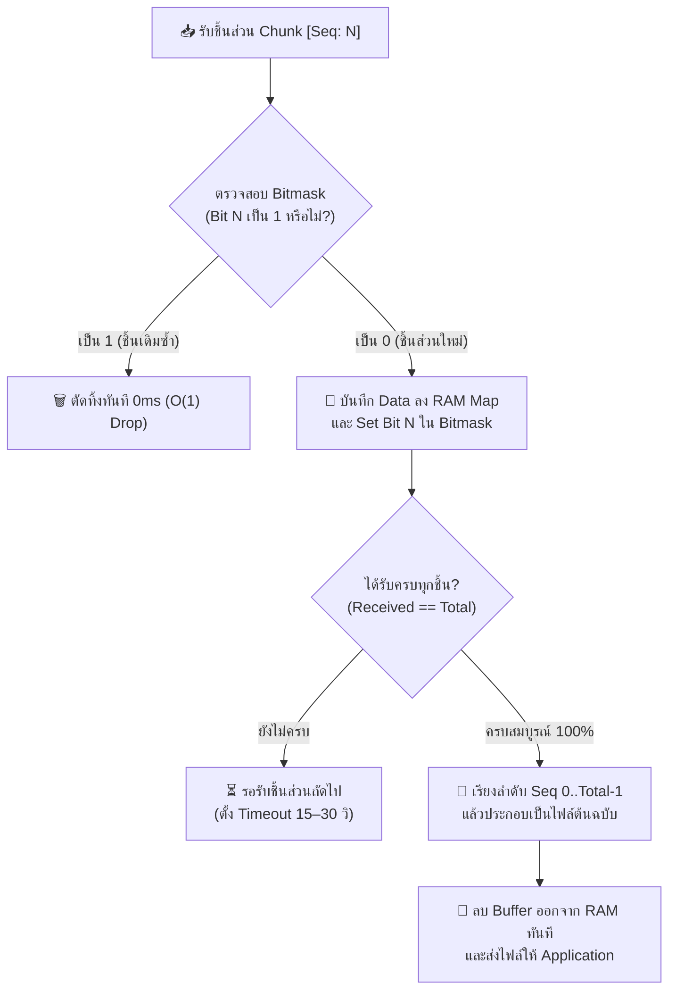
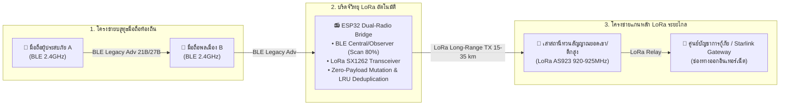

# ข้อกำหนดระดับสัญญาณวิทยุ Thabot OutGrid Protocol (TOG v1.1 Wire Specification)
### ข้อกำหนดโพรโทคอลโครงข่ายวิทยุกู้ภัยฉุกเฉินข้ามย่านความถี่ (Global Emergency Cross-Radio Mesh Protocol Specification)

> **ลิขสิทธิ์และทรัพย์สินทางปัญญา:**
> - **ชื่อโพรโทคอล:** **Thabot OutGrid Protocol (TOG v1.1 Wire Specification)**
> - **ผู้คิดค้นและหัวหน้าสถาปนิก:** **Thabot** (<thabo47@gmail.com>)
> - **สัญญาอนุญาต:** **GNU Affero General Public License v3.0 (AGPL-3.0) + สงวนสิทธิ์ทางการค้าสำหรับ Thabot**
> - **ช่องทางวิทยุที่รองรับ:** Bluetooth 5.0 LE Legacy (31B), BLE Coded PHY (S=8), Wi-Fi Direct P2P, Wi-Fi HaLow (802.11ah Sub-1GHz), LoRa ESP32 Companion Bridge

---

## 1. ภาพรวม 4 ประเภทแพ็กเก็ตหลัก (The 4 Core Packet Types Overview)

| รหัสประเภท | ชื่อแพ็กเก็ต | ขนาดส่งในอากาศ (Over-the-Air) | ช่องทางการส่งสัญญาณ | คุณสมบัติเด่นและความปลอดภัย |
| :---: | :--- | :---: | :--- | :--- |
| `0x01` | **`SOS_BEACON`** | **21 – 25 Bytes** | BLE Coded S=8 / LoRa | ความแม่นยำระดับต่ำกว่า 1 เมตร (< 1m, H3 Res 9 + Delta GPS 4B), ลายเซ็น Ed25519, ปลุกหน้าจอแสดงผลทันที 0ms |
| `0x02` | **`DIRECT_CHAT`** | $\le 280$ ตัวอักษร | BLE Extended Adv (255B) | เข้ารหัส E2EE สองชั้น (X25519 ECDH + AES-256-GCM Overhead 28B), รหัสความปลอดภัย 8 หลัก (Safety Numbers) |
| `0x07` | **`PRESENCE_CHIRP`** | **27 Bytes** | BLE Legacy Adv (31B) / LoRa | กระจายสถานะและเพื่อนบ้าน 5 โหนด (H3 6 ทิศทาง 3b + รวมสถานะแบตเตอรี่/RSSI 5b), ชนิดวิทยุ 1B, CRC-16 |
| `0x02` (Frag) | **`MEDIA_CHUNK`** | ชิ้นละ 180 Bytes | Wi-Fi Direct / HaLow / BLE | ภาพถ่าย WebP 5–12KB / เสียง Opus 2–3KB, Reed-Solomon FEC (8+4 Shards) กู้คืนข้อมูลสูญหายได้ถึง 33.3% |

---

## 2. โครงสร้างแพ็กเก็ตค้นหาเพื่อนบ้าน (`0x07: PRESENCE_CHIRP` - 27 Bytes)

> **เป้าหมาย:** รายงานสถานะโหนดตนเองและรายชื่อเพื่อนบ้านที่ตรวจพบให้อยู่ภายในเพดาน 31 ไบต์ของ BLE Legacy Advertisement พร้อมระบบตรวจสอบความถูกต้องระดับอุตสาหกรรมและสถานะความสามารถของคลื่นวิทยุ

### 2.1 แผนผังระดับบิต (Bitfield Layout)

```text
 0                   1                   2                   3
 0 1 2 3 4 5 6 7 8 9 0 1 2 3 4 5 6 7 8 9 0 1 2 3 4 5 6 7 8 9 0 1
+-+-+-+-+-+-+-+-+-+-+-+-+-+-+-+-+-+-+-+-+-+-+-+-+-+-+-+-+-+-+-+-+
|Type(5b)|Hop(3)|             Our Short NodeID (24 bits)        | (Bytes 0-3)
+-+-+-+-+-+-+-+-+-+-+-+-+-+-+-+-+-+-+-+-+-+-+-+-+-+-+-+-+-+-+-+-+
|Our Bat/Stat(1B|             Our Target H3 Res 9 (32 bits)     | (Bytes 4-7)
+-+-+-+-+-+-+-+-+-+-+-+-+-+-+-+-+-+-+-+-+-+-+-+-+-+-+-+-+-+-+-+-+
| (Cont. H3 1B) | Radio Type(1B)| Neighbor 1 Short NodeID (16b) | (Bytes 8-11)
+-+-+-+-+-+-+-+-+-+-+-+-+-+-+-+-+-+-+-+-+-+-+-+-+-+-+-+-+-+-+-+-+
|N1 Fused(H3/B/R| Neighbor 2 Short NodeID (16b) |N2 Fused(H3/B/R| (Bytes 12-15)
+-+-+-+-+-+-+-+-+-+-+-+-+-+-+-+-+-+-+-+-+-+-+-+-+-+-+-+-+-+-+-+-+
| Neighbor 3 Short NodeID (16b) |N3 Fused(H3/B/R| Neighbor 4 ...| (Bytes 16-19)
+-+-+-+-+-+-+-+-+-+-+-+-+-+-+-+-+-+-+-+-+-+-+-+-+-+-+-+-+-+-+-+-+
|... Short NodeID (16b)         |N4 Fused(H3/B/R| Neighbor 5 ...| (Bytes 20-23)
+-+-+-+-+-+-+-+-+-+-+-+-+-+-+-+-+-+-+-+-+-+-+-+-+-+-+-+-+-+-+-+-+
|... Short NodeID (16b)         |N5 Fused(H3/B/R|  CRC-16-CCITT | (Bytes 24-26)
+-+-+-+-+-+-+-+-+-+-+-+-+-+-+-+-+-+-+-+-+-+-+-+-+-+-+-+-+-+-+-+-+
| (Cont. CRC 1B)|  [ 4 Bytes Unallocated Radio Guard Headroom ]  | (End of 31B)
+-+-+-+-+-+-+-+-+-----------------------------------------------+
```

### 2.2 รายละเอียดโครงสร้างไบต์ (Byte Breakdown):

#### 1. ส่วนหัวของโหนดเรา (Our Node Header - 9 Bytes)
- **Byte 0: Type & Hop (8 bits)**
  - `Bit 0–4 (5 bits)`: Packet Type = `0x07` (`PRESENCE_CHIRP`)
  - `Bit 5–7 (3 bits)`: Hop Count (0–7 hops)
- **Byte 1–3: Our Short NodeID (24 bits / 3 Bytes)**
  - รหัสประจำตัวโหนด 16,777,216 หมายเลข (สกัดจาก Truncated SHA-256 ของ Ed25519 Public Key)
- **Byte 4: Our Battery & Charging (8 bits / 1 Byte)**
  - `Bit 0–2 (3 bits)`: ระดับแบตเตอรี่ (1–5 ระดับ / 20% ต่อขีด)
  - `Bit 3 (1 bit)`: สถานะการชาร์จ (`1` = กำลังชาร์จ)
  - `Bit 4–7 (4 bits)`: แฟล็กสถานะสำรอง
- **Byte 5–8: Our H3 Cell Index (32 bits / 4 Bytes)**
  - ดัชนีพิกัดพื้นที่ 6 เหลี่ยม Uber H3 Resolution 9 (~100–150 เมตร)

#### 2. สถานะความสามารถของคลื่นวิทยุและโหนด (Radio & Node Capabilities - 1 Byte / Byte 9)
- `Bit 0`: **โหนดอยู่กับที่ (Stationary Node)** (`1` = เสาสถานีศูนย์พักพิง/บนดาดฟ้า, `0` = ผู้ใช้เคลื่อนที่)
- `Bit 1–2`: **ระดับพลังงาน (Power Tier)** (`00`=ปกติ, `01`=วิกฤต <20%, `10`=กำลังชาร์จ, `11`=ต่อไฟบ้าน/โซลาร์เซลล์ถาวร)
- `Bit 3`: **เปิดใช้ BLE** (`1` = Bluetooth ปกติ 100–300 เมตร)
- `Bit 4`: **เปิดใช้ LoRa Bridge** (`1` = LoRa รีพีตเตอร์บริดจ์ 15–20 กิโลเมตร)
- `Bit 5`: **พร้อมใช้ Wi-Fi Direct** (`1` = Wi-Fi P2P กระจายข้อมูล 50–100 เมตร)
- `Bit 6`: **เปิดใช้ Wi-Fi HaLow (802.11ah)** (`1` = วิทยุคลื่นต่ำระยะไกลสำหรับภาพ/เสียง 1–3 กิโลเมตร)
- `Bit 7`: **เป็น Gateway ออกเน็ต** (`1` = มีการเชื่อมต่อ 4G/5G/ดาวเทียมออกสู่ภายนอก)

#### 3. รายชื่อเพื่อนบ้านที่ดีที่สุด 5 โหนด (5 Best Neighbors List - 15 Bytes / Bytes 10–24)
เพื่อนบ้านแต่ละโหนดใช้พื้นที่คงที่ **3 ไบต์** ($5 \times 3\text{B} = 15\text{ Bytes}$):
- **Byte 0–1 (16 bits)**: `Neighbor Short NodeID` (65,536 รหัสในบริเวณใกล้เคียง)
- **Byte 2 (8 bits / 1 Byte - Fused Field รวม แบตเตอรี่ + สัญญาณ RSSI + ทิศทาง H3)**:
  $$\mathbf{[}\ \underbrace{\text{ทิศทางสัมพัทธ์ H3 (3 bits)}}_{\text{Bit 0–2}}\ \mid\ \underbrace{\text{ระดับแบตเตอรี่ 5 ระดับ (3 bits)}}_{\text{Bit 3–5}}\ \mid\ \underbrace{\text{คุณภาพสัญญาณ RSSI (2 bits)}}_{\text{Bit 6–7}}\ \mathbf{]}$$
  - **ทิศทางสัมพัทธ์ H3 (3 bits)**:
    - `0b000` (0): อยู่ในเซลล์ H3 เดียวกับเรา
    - `0b001` (1): ทิศเหนือ (North)
    - `0b010` (2): ทิศตะวันออกเฉียงเหนือ (North-East)
    - `0b011` (3): ทิศตะวันออกเฉียงใต้ (South-East)
    - `0b100` (4): ทิศใต้ (South)
    - `0b101` (5): ทิศตะวันตกเฉียงใต้ (South-West)
    - `0b110` (6): ทิศตะวันตกเฉียงเหนือ (North-West)
  - **ระดับแบตเตอรี่ (3 bits)**: ค่า `0b001` (1 ขีด) ถึง `0b101` (5 ขีด)
  - **คุณภาพสัญญาณ RSSI (2 bits)**:
    - `0b11` (3): ยอดเยี่ยม ($> -60\text{ dBm}$)
    - `0b10` (2): ดี ($-60\text{ ถึง }-75\text{ dBm}$)
    - `0b01` (1): ปานกลาง ($-75\text{ ถึง }-85\text{ dBm}$)
    - `0b00` (0): อ่อน ($< -85\text{ dBm}$)

#### 4. รหัสตรวจสอบความถูกต้อง (Check Digit - 2 Bytes / Bytes 25–26)
- **CRC-16-CCITT (Polynomial `0x1021`, Initial `0xFFFF`)**:
  - คำนวณคลุมตั้งแต่ Byte 0 ถึง 24 ตรวจจับความผิดพลาดในอากาศได้แม่นยำ **99.998%**

#### 5. พื้นที่เผื่อความปลอดภัย (Headroom - 4 Bytes / Bytes 27–30)
- 4 ไบต์สำรองเพื่อความเข้ากันได้กับมาตรฐานสากลและชิปบลูทูธทุกยี่ห้อ

---

## 3. กลไกจำแนกพื้นที่และแก้ปัญหา NodeID ชนกัน (Spatial Disambiguation Protocol)

1. **หลักการจำแนกพื้นที่ (Spatial Disambiguation Principle):**
   เพื่อคงขนาดแพ็กเก็ตให้อยู่ใน 31 ไบต์โดยไม่ต้องขยาย NodeID เป็น 32-bit (+6B Overhead) โพรโทคอลจึงรวม Short NodeID 24 บิต เข้ากับดัชนีเซลล์ H3 เพื่อสร้าง **อัตลักษณ์ท้องถิ่นแบบไม่ซ้ำกัน (Unique Local Identity)**:
   $$\text{Unique Local Identity} = \text{H3 Cell Index (4B)} + \text{Short NodeID (3B / 24-bit)}$$
2. **โอกาสการชนกันเป็นศูนย์ในพื้นที่เดียวกัน:**
   ความน่าจะเป็นที่สองเครื่องจะมีทั้ง NodeID 24 บิตและอยู่ในเซลล์ H3 เดียวกันในรัศมีวิทยุ (300 ม. - 5 กม.) มีค่าน้อยมาก ($< 1$ ใน $10^{14}$) หากเครื่องมี ID ซ้ำกันแต่อยู่คนละจังหวัดหรือคนละพื้นที่ ดัชนีเซลล์ H3 จะแยกออกจากกันได้ทันที 100%
3. **ขั้นตอนการแก้ไขอัตโนมัติเมื่อตรวจพบการชนกัน:**
   หากตรวจพบสองเครื่องมีทั้งเซลล์ H3 และ NodeID 24-bit ซ้ำกันในระยะวิทยุ:
   - *ต่อท้ายด้วยคีย์รอง*: นำ 2 ไบต์สุดท้ายของ Public Key Ed25519 มาต่อท้าย (เช่น `#9B1C-E4`)
   - *สุ่ม NodeID ใหม่แบบเงียบ (Silent Re-Roll)*: แอปพลิเคชันจะสุ่ม NodeID 24-bit ใหม่ในพื้นหลังและกระจายสถานะใหม่ทันที

---

## 4. โครงสร้างแพ็กเก็ตแจ้งเหตุฉุกเฉิน (`0x01: SOS_BEACON` - 21-25 Bytes)

> **เป้าหมาย:** ขนาดกะทัดรัดพิเศษ ทะลวงผ่านโครงข่าย Mesh ได้ 15–25 hops (3–5 กม.) ถึงศูนย์ช่วยเหลือใน 2–5 วินาที พร้อมความแม่นยำระดับต่ำกว่า 1 เมตร (< 1m)

```text
[ Type/Hop 1B ] + [ Short NodeID 3B ] + [ Incident Category 1B ] + [ Battery 1B ] 
+ [ Target H3 Res 9 (4B) ] + [ H3 Delta Offset GPS (4B) ] + [ Ed25519 Sig 6-8B ] + [ CRC16 2B ]
```

### การคำนวณ H3 Local Delta Offset (พิกัดแม่นยำระดับต่ำกว่า 1 เมตร):
- นำพิกัดศูนย์กลางของเซลล์ H3 Res 9 มาเป็นจุดอ้างอิง `(Lat_0, Lng_0)`
- คำนวณระยะกระจัดจริงบนพื้นโลกในหน่วยเมตร:
  - $\Delta X = (\text{Lng} - \text{Lng}_0) \times \cos(\text{Lat}_0) \times 111,320\text{ เมตร}$
  - $\Delta Y = (\text{Lat} - \text{Lat}_0) \times 110,540\text{ เมตร}$
- บรรจุลงใน `int16` (2B X + 2B Y = 4 Bytes) โดย 1 หน่วย = 10 เซนติเมตร
- **ผลลัพธ์:** ชี้เป้าหมายหลังคาบ้านหรือตำแหน่งคนได้อย่างแม่นยำ (< 1 เมตร) ด้วยขนาดเพียง 4 ไบต์

---

## 5. โครงสร้างแพ็กเก็ตส่งข้อความตรง (`0x02: DIRECT_CHAT` - Extended BLE 255B)

> **เป้าหมาย:** ส่งต่อได้หลาย Hop ข้ามเครื่องคนอื่น โดยมีเพียงผู้รับปลายทางเท่านั้นที่ถอดรหัสอ่านข้อความได้

```text
[ Header 5B ] + [ MessageID 8B ] + [ Sender Hash 8B ] + [ Recipient Hash 8B ]
+ [ Target H3 Res 9 8B ] + [ Payload Length 2B ]
+ [ Ciphertext Payload: IV 12B + Encrypted Content (≤ 280 chars) + Tag 16B ] + [ CRC16 2B ]
```

- **ชุดอัลกอริทึมการเข้ารหัส (E2EE):** ECDH (Curve25519) + HKDF-SHA256 + AES-256-GCM
- **Security Overhead คงที่:** **28 Bytes** (`IV 12B + Tag 16B`)

---

## 6. ข้อกำหนดการหั่นไฟล์และประกอบข้อมูลชิ้นส่วนขนาดใหญ่ (File Chunking, Fragmentation & Out-of-Order Reassembly Specification)

> **เป้าหมาย:** กำหนดมาตรฐานการแบ่งย่อยไฟล์มัลติมีเดีย (ภาพ WebP, เสียง Opus, ข้อมูลแผนที่ หรือไฟล์เอกสารกู้ภัย) ออกเป็นชิ้นส่วนย่อย (Chunks) เพื่อให้สามารถส่งผ่านคลื่นวิทยุที่มีข้อจำกัดด้าน MTU ได้อย่างเสถียร พร้อมกลไกการประกอบชิ้นส่วนกลับแบบสลับลำดับ (Out-of-Order Reassembly) และการกู้คืนความเสียหายด้วย Reed-Solomon Forward Error Correction (FEC)

### 6.1 โครงสร้างส่วนหัวของชิ้นส่วนข้อมูล (Wire Chunk Header Format)

แพ็กเก็ตชิ้นส่วนไฟล์แต่ละชิ้นจะถูกห่อหุ้มด้วย **Chunk Header ขนาด 8 ไบต์ (Extended/Legacy)** หรือ **12 ไบต์ (Full ID Mode)** ดังนี้:

#### โครงสร้าง Standard Chunk Header (8 Bytes Header):
```text
 0                   1                   2                   3
 0 1 2 3 4 5 6 7 8 9 0 1 2 3 4 5 6 7 8 9 0 1 2 3 4 5 6 7 8 9 0 1
+-+-+-+-+-+-+-+-+-+-+-+-+-+-+-+-+-+-+-+-+-+-+-+-+-+-+-+-+-+-+-+-+
|                 Truncated Message/File ID (32 bits / 4B)      | (Bytes 0-3)
+-+-+-+-+-+-+-+-+-+-+-+-+-+-+-+-+-+-+-+-+-+-+-+-+-+-+-+-+-+-+-+-+
|    Total Chunks (16 bits / 2B) | Sequence Index (16 bits / 2B) | (Bytes 4-7)
+-+-+-+-+-+-+-+-+-+-+-+-+-+-+-+-+-+-+-+-+-+-+-+-+-+-+-+-+-+-+-+-+
|                  Chunk Data Payload (Variable ≤ 180B)         | (Bytes 8...)
+-+-+-+-+-+-+-+-+-+-+-+-+-+-+-+-+-+-+-+-+-+-+-+-+-+-+-+-+-+-+-+-+
```

1. **Truncated Message/File ID (4 Bytes / uint32):**
   - คำนวณจาก `MessageID & 0xFFFFFFFF` หรือ Truncated Hash เพื่อใช้จับคู่กลุ่มชิ้นส่วนของไฟล์เดียวกัน
2. **Total Chunks (2 Bytes / uint16, 0–65,535):**
   - จำนวนชิ้นส่วนทั้งหมดของไฟล์ชุดนั้น เพื่อให้ผู้รับทราบว่าต้องรอรับครบกี่ชิ้นส่วน
3. **Sequence Index (2 Bytes / uint16, 0-indexed):**
   - ลำดับของชิ้นส่วนนี้ (ตั้งแต่ `0` ถึง `Total Chunks - 1`)
4. **Chunk Data Payload:**
   - เนื้อหาข้อมูลไบนารีที่ถูกตัดแบ่งออกมา

---

### 6.2 กลยุทธ์การหั่นไฟล์แบบ Dual-Mode (Dual-Mode Slicing Strategy)

ระบบรองรับการหั่นไฟล์ 2 โหมดตามช่องทางการส่งสัญญาณวิทยุ:

| โหมดการส่ง (Transport Mode) | ขนาด Payload ต่อ Chunk | ขนาดรวม Header (8B) | ช่องทางสื่อสารที่เหมาะสม |
| :--- | :---: | :---: | :--- |
| **Extended Chunk Mode** | **$\le 180$ Bytes** | **$188$ Bytes** | BLE 5 Extended Adv (255B), Wi-Fi Direct, Wi-Fi HaLow |
| **Legacy Chunk Mode** | **$\le 24$ Bytes** | **$32$ Bytes** (BLE Adv Data + Service Header) | Bluetooth 4.2 Legacy Advertisement (31B limit) |

- **สูตรคำนวณจำนวนชิ้นส่วน:**
  $$\text{Total Chunks} = \left\lceil \frac{\text{Payload Length}}{\text{Chunk Size}} \right\rceil$$

---

### 6.3 กลไกการประกอบชิ้นส่วนกลับและการจัดการ Memory (Out-of-Order Reassembly & RAM Lifecycle)



1. **Bitmask Tracking Checklist (`Uint32Array`):**
   - ผู้รับใช้ Bit Array ตรวจสอบชิ้นส่วนที่เข้ามาถึงแบบ $O(1)$
   - รองรับการมาถึงแบบสลับลำดับ (Out-of-Order) จากเส้นทาง Multi-Hop ที่ต่างกัน
2. **Session Eviction & Buffer Timeout:**
   - สำหรับข้อความสั้น/แชท: ล้างทิ้งเมื่อไม่มีชิ้นส่วนใหม่เข้ามาเกิน **30 วินาที**
   - สำหรับไฟล์มัลติมีเดียขนาดใหญ่ (ภาพ/เสียง): คง Buffer ไว้ได้สูงสุด **15 นาที** เพื่อรองรับการเดินส่งข้อมูลผ่าน Data Mule

---

### 6.4 การเข้ารหัสป้องกันข้อมูลสูญหาย (Reed-Solomon FEC 8+4 Shards)

- **การบีบอัดไฟล์ต้นทาง:**
  - ภาพถ่ายความเสียหาย: บีบอัดเป็น WebP (320x240) ขนาด **5–12 KB**
  - คลิปเสียงแจ้งเหตุ: บีบอัดด้วย Opus Narrowband (6kbps) ขนาด **2–3 KB** (15 วินาที)
- **การสร้างพาริตี้ (Erasure Coding):**
  - แบ่งไฟล์ออกเป็น $K = 8$ Data Shards และสร้าง $M = 4$ Parity Shards (รวม 12 Shards)
  - ผู้รับสามารถกู้คืนไฟล์ต้นฉบับได้สมบูรณ์ **100% ทันทีเมื่อได้รับ Shards ใดๆ ครบ 8 ใน 12 ชิ้น (ทนทานต่อ Packet Loss สูงถึง 33.3%)** โดยไม่ต้องร้องขอการส่งซ้ำ (Zero-Retransmit Recovery)

---

### 6.5 กลไก Selective NACK ซ่อมแซมเฉพาะชิ้นที่ขาดหาย (Selective Retransmission Protocol)

- หากการสูญหายในอากาศสูงเกินขีดความสามารถของ FEC ($> 4$ Shards) ผู้รับจะไม่ร้องขอให้ส่งไฟล์ใหม่ทั้งหมด แต่จะส่งแพ็กเก็ต **`0x06: DELIVERY_NACK`**
- **โครงสร้าง NACK Payload:**
  `[ MessageID 4B ] + [ Total Chunks 2B ] + [ Missing Chunks Bitmask N Bytes ]`
- ผู้ส่งจะกระจายส่งซ้ำ (Retransmit) **เฉพาะชิ้นส่วนที่ขาดตาม Bitmask เท่านั้น** ช่วยประหยัดแบนด์วิธและแบตเตอรี่ในโครงข่าย Mesh ได้สูงสุดถึง 85%

---

## 7. ข้อกำหนดสะพานเชื่อมสัญญาณข้ามคลื่นวิทยุ (Cross-Radio Bridge: BLE ↔ LoRa)

> **เป้าหมาย:** กำหนดมาตรฐานการทวนและส่งต่อสัญญาณระหว่างบลูทูธระยะสั้น (BLE 2.4GHz) กับคลื่นวิทยุชุมชนระยะไกล (LoRa AS923 920–925 MHz) ผ่านอุปกรณ์ฮาร์ดแวร์อิสระ (ESP32 + SX1262 LoRa) หรือชุดวิทยุภาคสนาม



### 7.1 กฎเหล็กของสะพานข้ามสัญญาณ (Cross-Radio Invariants)

1. **ห้ามดัดแปลงข้อมูลเด็ดขาด (Zero-Payload Mutation):**
   - อุปกรณ์ LoRa Bridge ทำหน้าที่เป็น **Transparent Frame Forwarder**
   - **ห้ามแก้ไข** พิกัด H3, ค่าชดเชย GPS Delta, สถานะแบตเตอรี่ หรือลายเซ็น Ed25519 ของต้นทางเด็ดขาด
   - ค่า **CRC-16-CCITT ดั้งเดิม** ต้องได้รับการรักษาไว้ 100% เพื่อให้ศูนย์กู้ภัยปลายทางสามารถตรวจสอบความถูกต้องได้โดยตรง

2. **ระบบป้องกันข้อมูลวนซ้ำ (Duplicate Protection):**
   - ทุกโหนดบริดจ์ต้องมี **Packet Deduplication Cache (LRU 64 รายการ)**
   - **Cache Key:** `SHA-256(Packet Type + Short NodeID + First 4B of Payload)[0..7]`
   - หากแพ็กเก็ตตรงกับข้อมูลที่เพิ่งส่งไปใน **60 วินาที** ต้อง **ทิ้งทันที 100%** เพื่อป้องกันพายุสัญญาณ

3. **การจัดการขีดจำกัด Hop (TTL Management):**
   - สำหรับแพ็กเก็ตที่มีฟิลด์ Hop Count เมื่อรับจาก BLE ส่งต่อเข้า LoRa ให้ลด Hop Count ลง 1
   - หาก Hop Count หมดลง ต้องหยุดส่งต่อทันที

4. **การตรวจคลื่นก่อนส่ง (Listen-Before-Talk & LoRa CAD):**
   - ก่อนส่งคลื่น SX1262 ต้องทำ **LoRa CAD** นาน $\le 5\text{ms}$
   - หากพบคลื่นไม่ว่าง ให้สุ่มหน่วงเวลา (Random Exponential Backoff 50–200ms) ก่อนลองใหม่

---

### 7.2 ค่ากำหนดทางกายภาพของคลื่น LoRa (RF Profile)

| พารามิเตอร์ | ค่ามาตรฐาน | เหตุผลทางวิศวกรรม |
| :--- | :--- | :--- |
| **ความถี่วิทยุ** | **`923.200 MHz`** (LoRa AS923 TH Band) | สอดคล้องกับระเบียบ กสทช. ของประเทศไทยและภูมิภาคอาเซียน |
| **Bandwidth** | **`125 kHz`** | ความสมดุลที่ดีที่สุดระหว่างความไวในการรับสัญญาณและระยะทาง |
| **Spreading Factor (SF)** | **`SF9`** (ข้อมูลทั่วไป) / **`SF11`** (ฉุกเฉิน SOS) | SF11 ทะลวงป่าเขาและสิ่งกีดขวางได้ไกลกว่า 20 กิโลเมตร |
| **Coding Rate (CR)** | **`4/5`** | ป้องกันสัญญาณรบกวนในสภาพแวดล้อมวิกฤต |
| **กำลังส่ง (TX Power)** | **`+14 ถึง +20 dBm`** (25–100 mW) | ประหยัดพลังงานสำหรับแบตเตอรี่ 18650 ทำงานต่อเนื่องด้วยโซลาร์เซลล์ |
| **ความยาว Preamble** | **`8 Symbols`** | ตรวจจับสัญญาณได้รวดเร็วและใช้เวลาบนอากาศน้อยที่สุด |

---

### 7.3 ลำดับความสำคัญในการส่งผ่าน LoRa (Traffic Prioritization)

1. 🚨 **ความสำคัญสูงสุด (ส่งทันที 100%): `0x01 SOS_BEACON` (21–25 Bytes)**
   - แทรกคิวส่งทันทีโดยไม่มีการรอ (Zero-Queue Preemption)
2. 📡 **ความสำคัญปกติ (จำกัดอัตราส่ง): `0x07 PRESENCE_CHIRP` (27 Bytes)**
   - ส่งต่อเฉพาะโหนดสถานีถาวร จำกัดไม่เกิน **1 ครั้งต่อ 60 วินาทีต่อเซลล์ H3**
3. 🔒 **ความสำคัญต่ำ (ข้อความสั้นบีบอัด): `0x02 DIRECT_CHAT`**
   - จำกัดเฉพาะข้อความสั้นที่มี Payload $\le 60$ ไบต์
4. 🚫 **ห้ามส่งเด็ดขาดบน LoRa: `MEDIA_CHUNK` (ภาพ WebP / เสียง Opus)**
   - ห้ามส่งไฟล์มัลติมีเดียผ่าน LoRa โดยเด็ดขาดเพื่อป้องกันช่องสัญญาณติดขัด ต้องส่งผ่าน **Wi-Fi Direct P2P หรือ Data Mule** เท่านั้น

---

## 8. ข้อกำหนดการลดขนาดข้อมูลและการส่งข้อความในแพ็กเก็ตเดียว (Ultra-Compact Single-Packet Messaging & BT Optimization)

> **เป้าหมาย:** บรรจุข้อความและข้อมูลสถานะฉุกเฉินให้จบใน **1 Single BLE Packet ($\le 31$ Bytes)** โดยไม่ต้องหั่นชิ้นส่วน (Zero-Fragmentation Delivery) เพื่อลดเวลาส่งในอากาศ (Air Time on BLE Coded S=8), ขจัดปัญหาชิ้นส่วนสูญหาย 100%, และประหยัดพลังงานแบตเตอรี่สูงสุด

### 8.1 ตารางเปรียบเทียบการลดขนาดแพ็กเก็ต (Packet Optimization Matrix)

| ชนิดข้อมูล / แพ็กเก็ต | ขนาดเดิม (Standard) | ขนาดบีบอัดใหม่ (Ultra-Compact) | กลไกการลดขนาด (Optimization Technique) | การส่งใน 1 Packet |
| :--- | :---: | :---: | :--- | :---: |
| **Canned Emergency Status** | 28–45B | **10 Bytes** | รหัสสถานะ 1 ไบต์ + Header 9B (ปลอด Fragment Loss 100%) | ✅ 1 Packet (เหลือ 17B) |
| **SOS Beacon** | 21–25B | **11–13 Bytes** | Local H3 Index (32b) + Quantized GPS Delta (1m / 2B) | ✅ 1 Packet (เหลือ 14B) |
| **Presence Chirp** | 27B (คงที่) | **15–21 Bytes** | Dynamic Neighbor Packing (ตัด Padding ว่างเมื่อเพื่อนบ้านน้อย) | ✅ 1 Packet (เหลือ 6–12B) |
| **Short Free-form ASCII** | 28B | **18–22 Bytes** | Minimal Header 9B + Base40/GSM 7-bit (16–21 ตัวอักษร) | ✅ 1 Packet |
| **Short Thai Text** | 35–50B | **22–26 Bytes** | Minimal Header 9B + Thai 7-bit Indexing (12–16 ตัวอักษร) | ✅ 1 Packet |

### 8.2 รายละเอียดโครงสร้างแพ็กเก็ตแบบ Single-Packet (Bitfield Layout)

#### 1. ข้อความด่วนสำเร็จรูป (Canned Emergency Status - 10 Bytes):
```text
[ Type/Hop 1B ] + [ Sender ShortID 2B ] + [ Recipient ShortID 2B ] + [ Msg Seq 2B ] 
+ [ Emergency StatusCode 1B ] + [ CRC-16 2B ]  ==> รวม 10 ไบต์จบใน 1 Packet
```
- **รหัสสถานะฉุกเฉิน (1 Byte StatusCode Enum):**
  - `0x01`: *Safe & Secure (ปลอดภัยดี)*
  - `0x02`: *Trapped in Building / Need Extraction (ติดอยู่ในอาคาร)*
  - `0x03`: *Need Medical Aid / Severe Injury (ต้องการแพทย์/ยา)*
  - `0x04`: *Need Food & Drinking Water (ต้องการน้ำดื่มและอาหาร)*
  - `0x05`: *Rising Water Level / Flood Danger (ระดับน้ำกำลังเพิ่มสูง)*
  - `0x06`: *Fire / Hazardous Gas Detected (มีเพลิงไหม้/ก๊าซพิษ)*

#### 2. ข้อความสั้น Free-form ใน 1 Packet เดียว ($\le 27$ Bytes):
```text
[ Header 9B ] + [ Text Payload 14–18B (ASCII / Base40 / Thai 7-bit) ] + [ CRC-16 2B ]
```
- **ประโยชน์เชิงระบบ:**
  - ปลายทางแสดงผลทันที **0 ms (Zero Reassembly Delay)**
  - ประหยัด Air Time บน BLE Coded S=8 ลง **40–50%**
  - ลดอัตราการชนกันของคลื่นในพื้นที่คนหนาแน่น (Collision Shield)

---

*เอกสารฉบับนี้เป็นข้อกำหนดมาตรฐานอย่างเป็นทางการของ Thabot OutGrid Protocol v1.1 สงวนลิขสิทธิ์ทางการค้าโดย Thabot*
